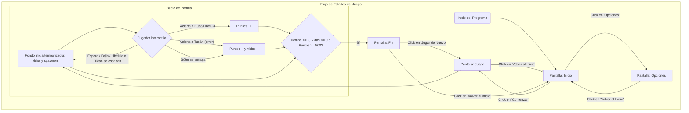
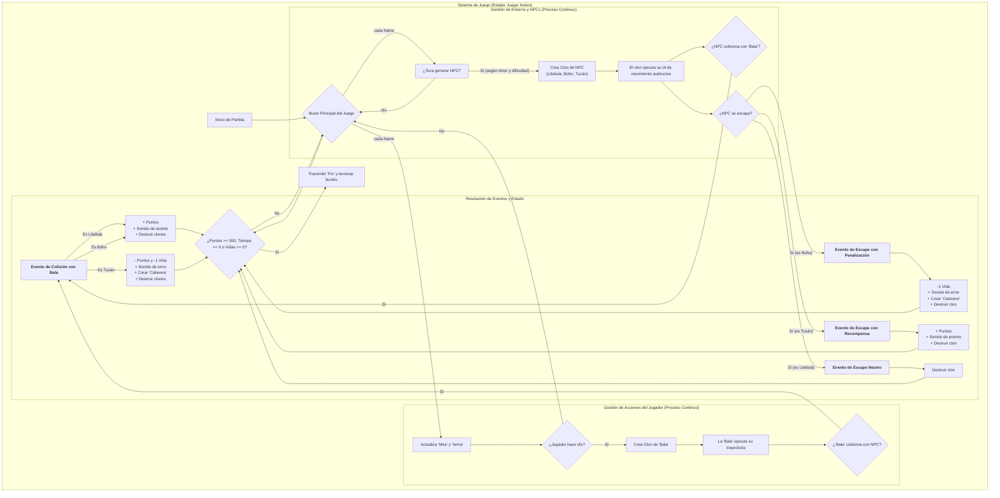

### ¿Qué ha cambiado en este diagrama?

1.  **Doble Salida de la IA:** El bloque `E[El clon ejecuta su IA...]` ahora tiene dos posibles salidas: `F[¿Colisiona con 'Bala'?]` y `G[¿Se escapa?]`. Esto es crucial porque tu juego ahora trata ambos eventos de forma diferente.
2.  **Resolución de Eventos Detallada:** El bloque de "Resolución" es mucho más rico:
    *   Ya no hay un genérico "Evento de Colisión". Ahora se ramifica según **el tipo de NPC** (`Libélula`, `Búho`, `Tucán`), mostrando las consecuencias únicas de cada colisión.
    *   Se ha añadido toda una nueva sección para los **Eventos de Escape**, mostrando también las diferentes consecuencias: la penalización del Búho, la recompensa del Tucán y la neutralidad de la Libélula.
3.  **Flujo de Consecuencias:** Todos los resultados (sumar puntos, restar vidas, etc.) ahora convergen en el bloque `V[Verificar Condición de Fin]`, que a su vez tiene la lógica actualizada (`>= 500 puntos`, `<= 0 vidas`, etc.).

Este nuevo diagrama es mucho más potente. Si se lo mostraras a otro programador, podría entender la esencia y la profundidad de tus mecánicas de juego sin necesidad de ver una sola línea de código. ¡Gran avance
### PANTALLA PRINCIPAL
- [x] Logo o título de juego
- [x] Se agregará botón de jugar
- [ ] Se agregará botón de leer reglas de juego (Instrucciones)
- [x] Botón de opciones
- [ ] Autor

### PANTALLA DE SELECCIÓN DE OPCIONES
- [x] Se agregará sección de dificultad
- [ ] Explicación de las dificultades
- [ ] Se pondrá selección de volumen global, sonido previo para comparar escucha, rotador de sonidos aleatorios
- [x] Botón para volver al menú
- [ ] Tengo que hacer un método para actualizar sonido

### PANTALLA DE JUEGO
- [x] Indicador de nivel de dificultad (la variable ya funciona e impacta el juego)
- [ ] Contador de puntos animado
- [ ] Timer animado
- [x] Indicador de vidas
- [x] Animación de vidas (los corazones y calaveras)
- [ ] Barra de vidas (si quieres un fondo para los corazones)
- [x] Se pondrá un sonido de vuelo a las libélulas (Aletear)
- [x] Se pondrá un sonido de disparo (Tennis Hit)
- [x] Se pondrá animación de golpe y salida de bala
- [x] Se pondrá sonido de muerte de libélula (Low Whoosh)
- [ ] Sonido de fallo de disparo (cuando se hace clic pero no se acierta)
- [x] Enemigo al que no dispararle y sus complementos derivados (Tucán)

### PANTALLA DE VICTORIA / DERROTA (Pantalla de Fin)
- [ ] Se agregará un personaje saltando y girando de izq a der con animación de fuegos artificiales y sonidos (para la victoria)
- [x] Se agregará sonido de pérdida de fondo (sonidos de victoria/derrota ya implementados)
- [x] Se pondrá un personaje triste (los NPCs llorando en el resumen)
- [ ] Se pondrá botón de reiniciar (Jugar de Nuevo) o salir (Volver al Inicio)
- [x] Mensaje de puntaje final
- [ ] Estadísticas rápidas (aciertos, fallos, precisión).

# To-Do
## Arma
### Que hace?
- **Función principal:** Actúa como la herramienta principal de interacción del jugador. Su lógica está autocontenida y gestiona el disparo y la nueva mecánica de recarga.
- **Inicialización:** Al iniciar el programa, el arma permanece oculta y define las variables del cargador (`Cargador - Balas totales` = 6, `Balas - En cargador` = 0).
- **Comportamiento en Juego:**
    - Se hace visible en la capa superior y sigue al puntero del mouse con un desplazamiento fijo.
    - Al hacer clic, dispara un clon del sprite `Bala`, realiza una animación de retroceso y suma 1 al contador de `Balas - En cargador`.
- **Sistema de Recarga Táctica (Automática y Manual):**
    - **Recarga Automática:** Después de disparar la 6ª bala, el arma activa automáticamente una secuencia de recarga.
    - **Recarga Manual:** El jugador puede pulsar la tecla **'R'** en cualquier momento para iniciar una recarga táctica.
    - **Feedback:** La recarga tiene una animación visual y un sonido distintivo, creando una pausa de 0.4 segundos que impide disparar. Al finalizar, resetea el contador `Balas - En cargador` a 0.
- **Decisión de Diseño:** El juego se centrará en una única arma. No se implementarán diferentes tipos de armas o balas.

### Que quiero que haga?
- **(Prioridad de Interfaz)** Crear un **contador visual** en la pantalla de juego que muestre las balas restantes en el cargador (ej: 6/6, 5/6, ...), para que el jugador pueda gestionar la recarga de forma más estratégica.

## NPC - Tucan
### Que hace?
- **Función principal:** Actúa como un NPC "sagrado" o "amigo". El objetivo del jugador es **NO dispararle**.

- **Generación de clones (Spawning):**
    - Crea un nuevo tucán en intervalos de tiempo aleatorios, cuya frecuencia y tamaño dependen de la `Dificultad`.
    - Lleva un registro de cuántos tucanes se han creado y cuántos han sido "abatidos" por error.

- **Comportamiento de cada tucán (clon):**
    - **Aparición y Trayectoria:**
        - Aparece a la izquierda y vuela horizontalmente, con un movimiento ondulatorio de zig-zag.
    - **Interacción (Penalización):**
        - Si el jugador le dispara, el tucán se destruye.
        - Penaliza duramente al jugador: le resta **25 puntos** y le quita **una vida**.
        - Reproduce un sonido de "cristal roto" para enfatizar el error.
        - **NUEVO:** Al ser destruido, crea un clon del sprite "Calavera" como un efecto visual adicional de la penalización.
    - **NUEVO - Interacción (Recompensa):**
        - Si el tucán logra cruzar la pantalla sano y salvo, **recompensa al jugador con +20 puntos**.

- **Resumen de Fin de Partida:**
    - Muestra un disfraz de "llorando" y un mensaje con el recuento de tucanes "abatidos" por error.

### Que quiero que haga?
- **(Prioridad de Pulido)** Añadir un sonido distintivo y "amigable" al aparecer.
- **(Prioridad de Gameplay)** Mejorar el patrón de movimiento de zig-zag para que se sienta más natural y menos predecible.
- **(Mejora Opcional)** Añadir un sonido de "recompensa" cuando el tucán escapa exitosamente.

## Boton - Opciones
### Que hace?
- Al iniciar el programa (bandera verde), el botón está oculto.
- Se muestra únicamente en la pantalla de "Inicio".
- Cuando el puntero del mouse está sobre él y se hace clic:
    - Reproduce un sonido "pop".
    - Envía la señal para cambiar a la pantalla de "Opciones".
    - Se oculta y detiene su funcionamiento.
- Permanece oculto en las pantallas de "Opciones" y "Juego".

### Que quiero que haga?
<!-- Aquí puedes anotar tus próximas ideas para este sprite -->
Deberia ponerse arriba sin ser clickable cuando entro a opciones y centrarse

## Sprite - Dificultad
### Que hace?
- Este sprite funciona como un elemento de la interfaz de usuario.
- Permanece oculto en todas las pantallas del juego ("Inicio", "Juego").
- Se muestra únicamente cuando el jugador entra en la pantalla de "Opciones".

### Que quiero que haga?
<!-- Aquí puedes anotar tus próximas ideas para este sprite -->

## Fondo (Stage)
### Que hace?
- **Función principal:** Actúa como el controlador central del juego, gestionando los estados, las variables globales y la lógica principal de la partida.
- **Inicialización:** Al iniciar el programa, define todas las variables globales clave, como los límites del escenario, las variables del menú, la dificultad por defecto, el tiempo, etc.
- **Gestión de Pantallas:** Cambia la imagen del fondo para que coincida con el estado actual del juego (`Inicio`, `Juego`, `Opciones`, `Instrucciones`, `Creditos`, `Fin`).
- **Lógica de Partida:**
    - **Inicialización:** Al empezar una partida, resetea todas las variables relevantes (puntos, vidas, balas, tiempo).
    - **Sistema de Vidas Modular:** Gestiona las vidas del jugador sumando las `Vidas iniciales` y las `Vidas extra` ganadas.
- **Condiciones de Fin de Partida:** Monitorea y finaliza la partida si ocurre alguna de estas condiciones:
    1.  **Victoria:** El jugador derrota a 20 libélulas.
    2.  **Derrota por Tiempo:** El temporizador de 30 segundos llega a cero.
    3.  **Derrota por Vidas:** El jugador pierde todas sus vidas.
- **Pantalla de Fin:**
    - Muestra un fondo específico dependiendo de la causa del final (Victoria, Sin Tiempo, Sin Vidas).
    - Calcula un `Puntaje final` complejo basado en el rendimiento general del jugador.

### Que quiero que haga?
<!-- Este sprite está COMPLETO. Su lógica y funcionalidad principal están finalizadas. -->

#### 1. Mecánicas de Juego Fundamentales

- [ ] **Sistema de Precisión:**
    - [ ] Crear variable global `balas_disparadas` e incrementarla al disparar.
    - [ ] Calcular la precisión (`bajas / disparos`) en la pantalla de `Fin`.
    - [ ] Mostrar el porcentaje de precisión en el resumen final.

#### 2. Flujo de Juego y Experiencia de Usuario

- [ ] **Pantalla Final (Fin):**
    - [ ] Añadir un botón funcional de **"Jugar de Nuevo"** que reinicie la partida emitiendo la señal `Juego`.
- [ ] **Pantallas de Menú:**
    - [ ] Crear un nuevo fondo (`backdrop`) para las **"Instrucciones"**.
    - [ ] Añadir un botón en la pantalla de `Inicio` que lleve a las "Instrucciones".
    - [ ] Añadir un botón en "Instrucciones" para volver a `Inicio`.
    - [ ] Crear un nuevo fondo (`backdrop`) para los **"Créditos"**.
    - [ ] Añadir un botón en la pantalla de `Inicio` u `Opciones` que lleve a los "Créd
    - [ ] Añadir un botón en "Créditos" para volver a `Inicio`.

# Hoja de Ruta del Proyecto
# ✅ Checklist Maestra Unificada (Recta Final v1.0)

### 🎯 Prioridad 1: Completar el Bucle de Gameplay Esencial
*(Tareas que definen si se puede jugar de principio a fin con todas las reglas claras)*
- Objetivo nuevo matar 20 libelulas
- **Pantalla de Estadísticas Finales:**
    - Mostrar el **Puntaje Final**
    ponerle carita feliz al tucan si al menos 70% de los tucanes pasaron

### ✨ Prioridad 2: Pulido de NPCs y Feedback al Jugador
*(Tareas que hacen que el juego se sienta vivo, justo y profesional)*

- **Pulido del Tucán:**
    - Mejorar el patrón de movimiento del zig-zag (con aleatoriedad o una curva sinusoidal).
    - Añadirle un sonido de aparición "amigable" para diferenciarlo.
    - Añadirle un sonido de "recompensa" cuando escapa exitosamente.
- **Pulido de la Libélula:**
    - Ajustar la frecuencia de aparición para que dependa de la `Dificultad`.
- **Efectos Visuales ("Game Feel"):**
    - Implementar el efecto **"Hit Flash"** (el enemigo parpadea en blanco al ser golpeado) para un mejor feedback de impacto.

    Hacer un contador de balas animación de recarga más elaborada

### ⚖️ Prioridad 3: Balance Final y Refinamiento Estético
*(Tareas de ajuste fino que se hacen cuando todo lo demás ya funciona)*

- **Balance de Dificultad:**
    - Revisar y ajustar las fórmulas de frecuencia de aparición y velocidad de todos los NPCs para que el juego escale bien de dificultad 1 a 5.
- **Balance de Puntuación:**
    - Revisar y ajustar la fórmula del `Puntaje Final` para que los valores que arroja se sientan justos y gratificantes.
- **Animaciones de la Interfaz:**
    - Añadir animaciones a los contadores de puntos y tiempo para que no sean estáticos.
    - Añadir la animación del "personaje victorioso" en la pantalla de Fin.
- **Organización del Código (Refactorización final):**
    - Revisar todos los sprites y ordenar las variables.
    - Asegurarse de que los nombres de las variables sean claros y consistentes.
    - Añadir comentarios finales donde la lógica sea especialmente compleja.

# Cerrado sin idea de modificar
## NPC
Refactorizar condiciones de detenimiento
## NPC - Buho
### Que hace?
- **Función principal:** Actúa como la **amenaza prioritaria** del juego, con un comportamiento dinámico y una recompensa que escalan con la dificultad.
- **Generación de clones (Spawning):**
    - **Balance Dinámico:** La frecuencia de aparición se calcula con una fórmula logarítmica, creando una curva de desafío pulida que aumenta la presión en los niveles más altos.
- **Comportamiento del clon:**
    - **Movimiento Dinámico:** La altura y velocidad de su "salto" inicial dependen de la dificultad, siguiendo una curva de gravedad realista. En niveles difíciles, sus saltos son cortos, rápidos y tensos.
    - **Animación y Sonido:** Reproduce un sonido de búho al aparecer y cambia de disfraz para reflejar cada fase de su movimiento (salto, burla, caída).
    - **Interacción (Destrucción):** Otorga una cantidad de puntos que escala con la dificultad (de 250 en D1 a 450 en D5), recompensando al jugador por el mayor desafío.
    - **Interacción (Escape / Penalización):** Si el búho se escapa, **penaliza al jugador quitándole una vida**. El escape se comunica con un sonido y la aparición de un sprite de "Calavera".
- **Resumen de Fin de Partida:**
    - Muestra un mensaje con el recuento de búhos abatidos.

## NPC - Libelula
### Que hace?
- **Función principal:** Actúa como el enemigo "grunt" más común del juego, con un comportamiento dinámico que escala con la dificultad.
- **Generación de clones (Spawning):**
    - **Balance Dinámico:** La **frecuencia de aparición** depende inversamente de la `Dificultad`, creando enjambres mucho más densos en los niveles altos.
- **Comportamiento del clon:**
    - Tiene una probabilidad de **1/25 de ser una variante Rara**.
    - **Movimiento Dinámico:** La **velocidad de vuelo** aumenta con la `Dificultad` siguiendo una curva de raíz cuadrada, proporcionando un escalado de desafío suave.
    - **Libélula Normal:** Otorga una cantidad de **puntos que escala** con la dificultad (de 100 en D1 a 180 en D5).
    - **Libélula Rara:** Otorga una gran recompensa en **puntos que escala** con la dificultad (de 500 en D1 a 900 en D5) además de **+1 Vida**.
    - **Comportamiento Común:** No resta vidas si se escapa y tiene feedback audiovisual completo.
- **Resumen de Fin de Partida:**
    - Muestra el recuento de libélulas abatidas.

## Sprite - Mira
### Que hace?
- **Función principal:** Actúa como el cursor principal del jugador, cambiando su apariencia y comportamiento según el estado del juego.

- **Comportamiento por estado:**
    - **En `Inicio` y `Fin` (Menús):**
        - Se muestra.
        - Se transforma en una "Estrella".
        - Sigue continuamente al puntero del mouse.
        - Gira constantemente, actuando como un cursor decorativo.
    - **En `Juego` (Partida):**
        - Se muestra.
        - Se asegura de apuntar en una dirección fija (90 grados) para evitar rotaciones no deseadas.
        - Se transforma en una "Mira de Arma" funcional.
        - Sigue continuamente al puntero del mouse de forma precisa.
    - **En `Opciones`:**
        - Hereda el comportamiento de la pantalla de `Inicio`, manteniendo la coherencia del cursor en los menús.

## Sprite - Corazon (UI Vidas)
### Que hace?
- **Función principal:** Actúa como el sistema visual que representa las vidas del jugador. El sprite original está oculto y se encarga de generar los clones de corazón.

- **Generación de clones (al recibir "Juego"):**
    - El sprite principal se prepara en la esquina superior de la pantalla.
    - **NUEVO:** Crea un clon por cada vida que tiene el jugador, con una pequeña pausa entre cada uno, creando una animación de "llenado" de la barra de vidas.

- **Comportamiento de cada clon de corazón:**
    - **Aparición:**
        - Se posiciona en la pantalla, espaciado correctamente de los otros corazones.
        - **NUEVO:** Reproduce un sonido `pop` al aparecer.
        - **NUEVO:** Realiza una pequeña animación de "salto" y crecimiento al ser creado.
    - **NUEVO - Animaciones Continuas:**
        - Una vez en pantalla, cada corazón entra en un bucle donde se anima constantemente, "tambaleándose" y dando pequeños saltos para que la interfaz se sienta viva.
    - **NUEVO - Lógica de Destrucción Visual:**
        - Cada corazón ahora está "atento" a si toca un sprite de "Calavera".
        - Si un "Sprite - Calavera" (generado por un error del jugador) lo toca, el corazón se autodestruye.
    - **Limpieza de Partida:**
        - Los clones se autodestruyen si el juego vuelve a la pantalla de "Inicio" o "Fin", dejando el escenario limpio para la siguiente partida.

## Sprite - Calavera (UI Efecto de Daño)
### Que hace?
- **Función principal:** Actúa como un **indicador visual permanente** de las vidas perdidas. El sprite original permanece siempre oculto.

- **Generación de clones:**
    - Un clon de este sprite se crea cada vez que el jugador comete un error que le cuesta una vida.

- **Comportamiento de cada clon de Calavera:**
    - **Aparición Inteligente:**
        - Aparece directamente sobre la interfaz de vidas.
        - Utiliza las mismas variables que el sprite de corazones para calcular su posición, apareciendo **exactamente sobre el último corazón de la fila**.
    - **Animación y Sonido de Aparición:**
        - Se hace visible, reproduce un sonido de error (`Oops`).
        - Realiza una animación de crecimiento para atraer la atención del jugador.
    - **Lógica de "Reemplazo":**
        - Su aparición sobre un `Sprite - Corazon` activa la lógica de destrucción de ese corazón.
    - **NUEVO - Decisión de Diseño:**
        - La calavera **no se autodestruye**. Permanece en la pantalla por el resto de la partida, actuando como un recordatorio visual y permanente del error cometido.

## Bala
### Que hace?
- **Función principal:** El sprite original actúa como una "plantilla" oculta. Su lógica principal se ejecuta en los clones que son creados por el `Arma`. Además de gestionar el proyectil en sí, este sprite también es el responsable de mostrar las estadísticas de precisión al final de la partida.
- **Contadores de Disparo:**
    - Al ser creado un clon, incrementa dos contadores clave:
        1.  `Balas - En cargador`: Para la mecánica de recarga del arma en tiempo real.
        2.  `Balas disparadas`: Para el cálculo de estadísticas al final de la partida.
- **Comportamiento del Clon (Proyectil):**
    - Se posiciona en el `Arma` y se desliza rápidamente hasta la posición del mouse en el momento del disparo.
    - Activa una `Bandera de disparo` por un breve instante (0.05s) para permitir que los NPCs detecten la colisión.
    - Al llegar a su destino, reproduce un efecto visual donde se encoge hasta desaparecer y luego se autodestruye.
- **Reporte de Estadísticas:**
    - Al recibir el evento `Fin`, el sprite original (no los clones) se hace visible en la pantalla de resumen.
    - Calcula y muestra un mensaje con la **precisión final del jugador**, usando la fórmula: `(Total de Bajas / Balas Disparadas) * 100`.
    - Maneja el caso especial de que el jugador no haya disparado en toda la partida.

## Botones
Tengo que refactorizarlos a todos para hacerlos independientes
de los demas eventos y solo dependan del evento en ejecucion
a travez de los cambios de fondos
## Boton - Creditos
### Que hace?
- **Función principal:** Actúa como el botón para acceder a la pantalla de "Créditos" desde el menú de inicio.
- **Comportamiento:**
    - Permanece oculto al inicio del programa y solo se hace visible en la pantalla de `Inicio`.
    - Su posición en el menú se calcula dinámicamente, alineándose con los otros botones.
    - Cuando el jugador hace clic sobre él, reproduce un sonido, emite el `broadcast('Creditos')` para cambiar de pantalla, y se oculta a sí mismo.
- **Gestión de Estados:**
    - El botón se asegura de permanecer oculto en todas las demás pantallas del juego para evitar interacciones no deseadas.

## Boton - comenzar
### Que hace?
- **Función principal:** Actúa como el botón principal para iniciar una partida desde el menú de inicio.
- **Comportamiento:**
    - Permanece oculto al inicio del programa y solo se hace visible en la pantalla de `Inicio`.
    - Su posición en el menú se calcula dinámicamente usando variables globales, lo que permite un posicionamiento consistente junto a otros botones.
    - Cuando el jugador hace clic sobre él, reproduce un sonido `pop`, emite el `broadcast('Juego')` para empezar la partida, y se oculta a sí mismo.
- **Gestión de Estados:**
    - El botón se asegura de permanecer oculto en todas las demás pantallas del menú (`Opciones`, `Instrucciones`, `Creditos`) para evitar interacciones no deseadas.

## Boton - Dificultad
### Que hace?
- **Función principal:** Gestiona el ajuste del nivel de dificultad del juego.
- **Comportamiento general:**
    - Solo se muestra en la pantalla de "Opciones". Permanece oculto en todas las demás.
    - Al aparecer, se divide en dos botones:
        1.  El sprite original se convierte en el botón para **"Aumentar"** la dificultad y se posiciona a la izquierda.
        2.  Inmediatamente crea un clon de sí mismo, que se convierte en el botón para **"Disminuir"** la dificultad y se posiciona a la derecha.
    - **NUEVO:** Se han reposicionado los botones en la parte superior de la pantalla (`y = 70`).

- **Funcionalidad de los botones:**
    - **Botón Aumentar (+):**
        - Al hacer clic, incrementa la variable "Dificultad" en 1.
        - El nivel máximo de dificultad es 5. Si se intenta superar, muestra un mensaje de advertencia.
    - **Botón Disminuir (-):**
        - Al hacer clic, reduce la variable "Dificultad" en 1.
        - El nivel mínimo de dificultad es 1. Si se intenta bajar más, muestra un mensaje de advertencia.
    - **Feedback:** Después de cada cambio, muestra el nuevo valor de dificultad por un momento.

## Boton - Inicio
### Que hace?
- **Función principal:** Actúa como el botón universal para "Volver al Menú Principal" desde cualquier pantalla secundaria del juego.
- **Comportamiento:**
    - Se muestra durante las pantallas de `Juego`, `Fin`, `Opciones`, y las nuevas pantallas de `Instrucciones` y `Creditos`.
    - Cuando el jugador hace clic en él, emite el `broadcast('Inicio')` para regresar al menú principal.
- **Gestión de Estados:**
    - Permanece oculto en la pantalla de `Inicio` para evitar redundancia y bucles.

## Boton - Instrucciones
### Que hace?
- **Función principal:** Actúa como el botón para acceder a la pantalla de "Instrucciones" o "Cómo Jugar" desde el menú de inicio.
- **Comportamiento:**
    - Permanece oculto al inicio del programa y solo se hace visible en la pantalla de `Inicio`.
    - Su posición en el menú se calcula dinámicamente, alineándose con los otros botones de la interfaz.
    - Cuando el jugador hace clic sobre él, reproduce un sonido, emite el `broadcast('Instrucciones')` para cambiar de pantalla, y se oculta a sí mismo.
- **Gestión de Estados:**
    - Se asegura de permanecer oculto en todas las demás pantallas del juego para evitar interacciones no deseadas.

## Boton - Jugar de Nuevo
### Que hace?
- **Función principal:** Actúa como el botón para reiniciar la partida inmediatamente desde la pantalla de resultados finales.
- **Comportamiento:**
    - Permanece oculto durante la mayor parte del juego.
    - Se hace visible únicamente en la pantalla de `Fin`, posicionado para un fácil acceso.
    - Cuando el jugador hace clic sobre él, reproduce un sonido, emite el `broadcast('Juego')` para lanzar una nueva partida, y se oculta a sí mismo.
- **Gestión de Estados:**
    - Se asegura de no ser visible en las pantallas de `Inicio` o durante la partida (`Juego`).

## Boton - Opciones
### Que hace?
- **Función principal:** Actúa como el botón para acceder a la pantalla de "Opciones" desde el menú de inicio.
- **Comportamiento:**
    - Permanece oculto al inicio del programa y solo se hace visible en la pantalla de `Inicio`.
    - Su posición en el menú se calcula dinámicamente, alineándose con los otros botones de la interfaz.
    - Cuando el jugador hace clic sobre él, reproduce un sonido, emite el `broadcast('Opciones')` para cambiar de pantalla, y se oculta a sí mismo.
- **Gestión de Estados:**
    - Se asegura de permanecer oculto en todas las demás pantallas del juego (`Juego`, `Instrucciones`, `Creditos`) para evitar interacciones no deseadas.

