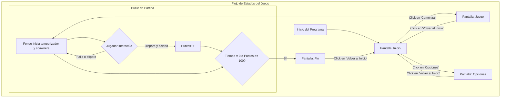

```mermaid
flowchart TD
    subgraph "Sistema de Juego (Estado 'Juego' Activo)"
        A[Inicio de Partida] --> B{Bucle Principal del Juego};
        
        subgraph "Gestión de Entorno y NPCs (Proceso Continuo)"
            B -- cada frame --> C[¿Toca generar NPC?];
            C -- Sí (según timer y dificultad) --> D["Crea Clon de NPC <br> (Libelula, Buho, Tucan)"];
            D --> E[El clon ejecuta su IA de movimiento autónomo];
            E --> F{¿NPC colisiona con 'Bala'?};
            C -- No --> B;
        end

        subgraph "Gestión de Acciones del Jugador (Proceso Continuo)"
            B -- cada frame --> G[Actualiza posición de 'Mira' y 'Arma'];
            G --> H{¿Jugador hace clic?};
            H -- Sí --> I[Crea Clon de 'Bala'];
            I --> J[La 'Bala' ejecuta su trayectoria];
            J --> K{¿'Bala' colisiona con NPC o sale de pantalla?};
            H -- No --> B;
        end
        
        subgraph "Resolución de Interacciones y Estado"
            F -- Sí --> L[<b>Evento de Colisión</b>];
            K -- Sí --> L;
            L --> M["+ Incrementar Puntos <br> + Reproducir Sonido <br> + Destruir Clones (Bala y NPC)"];
            M --> N[Verificar Condición de Fin];
            
            K -- No --> J;
            F -- No --> E;
            
            B --> N;
        end
        
        N{¿Puntos >= 100 o Tiempo <= 0?} -- Sí --> O[Transmitir 'Fin' y terminar bucle];
        N -- No --> B;
    end
 ```

    PANTALLA PRINCIPAL
    Logo o titulo de juego
    Se agregará boton de jugar
    Se agregará botón de leer reglas de juego
    Boton de opciones
    Autor
  
    PANTALLA DE SELECCIÓN DE OPCIONES
    Se agregará sección de dificultad, explicación de ellas
    Se pondrá selección de volumen global, sonido previo para comparar escucha, rotador de sonidos aleatorios
    Boton para volver al menú
    Tengo que hacer un metodo actualizar sonido

    PANTALLA DE JUEGO
    Indicador de nivel de dificultad
    Contador de puntos animado
    Timer animado
    Indicador de vidas
    Animación de vidas
    Barra de vidas
    Se pondra un sonido de vuelo a las libelulas
    Se pondra un sonido de disparo
    Se pondra nimacion de golpe y salida de bala
    Se pondra sonido de muerte de libelula
    Sonido de fallo de disparo
    Enemigo al que no dispararle y sus complementos derivados

    PANTALLA DE VICTORIA
    Se agregara un personaje saltando y girando de izq a der conanimación de fuegos artificiales y sonidos
    Se pondrá botón de reiniciar o salir
    Se pondrá boton de siguiente dificultad
    Mensaje de puntaje final
    Estadísticas rápidas (aciertos, fallos, precisión).

    PANTALLA DE DERROTA
    Se agregara un sonido de golpe 
    Se agregará sonido de perdida de fondo
    Se pondra un personaje triste
    Se pondrá Boton de reiniciar o salir
    Se pondrá boton de anterior dificultad
    Mensaje de puntaje final
    Estadísticas rápidas (aciertos, fallos, precisión).
# To-Do

## NPC - Libelula
### Que hace?
- **Función principal:** El sprite original está oculto y actúa como un generador (spawner) de enemigos. También muestra el resumen de bajas en la pantalla final.

- **Generación de clones (Spawning):**
    - Únicamente durante el estado de "Juego", crea una nueva libélula (un clon) cada medio segundo.
    - Lleva un registro de cuántas libélulas se han creado en total (`Creacion de libelulas`).

- **Comportamiento de cada libélula (clon):**
    - **Aparición y movimiento:**
        - Aparece en una posición horizontal aleatoria sobre una "línea de horizonte".
        - Se le asigna un destino final aleatorio en la parte superior de la pantalla.
        - Se desliza suavemente en línea recta hacia su destino.
        - Su velocidad aumenta según el nivel de "Dificultad".
    - **Animación:**
        - Aletea constantemente, cambiando entre varios disfraces para simular el vuelo.
    - **Interacción y destrucción:**
        - Si es tocada por la 'Bala', se destruye.
        - Al ser destruida, otorga **5 puntos** al marcador.
        - Incrementa el contador de `Bajas de libelulas`.
        - Reproduce un sonido (`Low Whoosh`) al ser destruida.
    - **Decisión de Diseño:** A diferencia de otros enemigos, la Libélula **no resta vidas** si se escapa. Es un objetivo puramente de puntuación.
    - **Limpieza:**
        - Todos los clones en pantalla se eliminan si el estado del juego deja de ser "Juego".

- **Resumen de Fin de Partida:**
    - Al llegar a la pantalla de "Fin", el sprite original se hace visible.
    - Se posiciona en la pantalla de resumen, inclinado.
    - Muestra un disfraz de "llorando".
    - Muestra un mensaje con el recuento final de libélulas abatidas versus las creadas.

### Que quiero que haga?
- **(Prioridad)** Añadir un sonido de "zumbido" o similar al momento de la aparición del clon para normalizarlo con los otros NPCs.
- **(Opcional - Mejora)** Hacer que la frecuencia de aparición de las libélulas dependa de la variable `Dificultad`, para un escalado más coherente.
## NPC - Buho
### Que hace?
- **Función principal:** El sprite original está oculto y actúa como un generador (spawner) de búhos enemigos. También muestra el resumen de bajas en la pantalla final.

- **Generación de clones (Spawning):**
    - Únicamente durante el estado de "Juego", crea clones de búho en intervalos de tiempo aleatorios.
    - A mayor nivel de "Dificultad", los búhos aparecen con más frecuencia.
    - **NUEVO:** Lleva un registro de cuántos búhos se han creado en total (`Creacion de buhos`).

- **Comportamiento de cada búho (clon):**
    - **Aparición y movimiento:**
        - Aparece en una posición horizontal aleatoria sobre una "línea de horizonte".
        - Realiza un "salto" hacia arriba con una velocidad inicial variable, haciéndolos menos predecibles.
        - Es afectado por una gravedad constante que lo hace acelerar hacia abajo.
        - Cae hasta desaparecer, momento en el que se autodestruye.
    - **Animación y Sonido:**
        - **NUEVO:** Reproduce un sonido de "salto" al aparecer.
        - **NUEVO:** Cambia de disfraz para reflejar cada fase de su movimiento: salto, caída y una nueva animación de "burla" en el aire (mira a izquierda o derecha) cuando está en el punto más alto de su salto, haciéndolo más expresivo.
    - **NUEVO - Interacción y destrucción:**
        - Si es tocado por la 'Bala', se destruye.
        - Al ser destruido, otorga **10 puntos** al marcador.
        - Incrementa el contador de `Bajas de buhos`.
        - Reproduce un sonido de "muerte".
    - **Limpieza:**
        - Todos los clones en pantalla se eliminan si el estado del juego deja de ser "Juego".

- **NUEVO - Resumen de Fin de Partida:**
    - Al llegar a la pantalla de "Fin", el sprite original se hace visible.
    - Se posiciona en la pantalla de resumen.
    - Muestra un disfraz de "llorando".
    - Muestra un mensaje con el recuento final de búhos abatidos versus los creados (ej: "Haz abatido 5 de 12 Buhos").
### Que quiero que haga?
<!-- Aquí puedes anotar tus próximas ideas para este sprite -->
Si el buho se escapa debe bajar una vida

## NPC - Tucan
### Que hace?
- **Función principal:** Actúa como un NPC "sagrado" o "amigo". El objetivo del jugador es **NO dispararle**. El sprite original está oculto y gestiona la generación de clones y el resumen final.

- **Generación de clones (Spawning):**
    - Únicamente durante el estado de "Juego", crea un nuevo tucán en intervalos de tiempo aleatorios.
    - Su frecuencia de aparición y su tamaño inicial dependen de la `Dificultad`.
    - Lleva un registro de cuántos tucanes se han creado y cuántos han sido "abatidos" por error.

- **Comportamiento de cada tucán (clon):**
    - **Aparición y Trayectoria:**
        - Aparece fuera de la pantalla a la izquierda, en una altura aleatoria, y vuela horizontalmente.
        - Crea un efecto de perspectiva, creciendo en tamaño al entrar en la pantalla.
    - **Movimiento Vertical y Animación:**
        - Realiza un movimiento ondulatorio de zig-zag mientras cruza la pantalla.
        - La animación de las alas está sincronizada con este movimiento.
    - **Interacción (Penalización):**
        - Si el jugador le dispara, el tucán se destruye.
        - Al ser destruido, **penaliza duramente al jugador**: le resta **25 puntos** y le quita **una vida**.
        - Reproduce un sonido de "cristal roto" para enfatizar el error.
    - **Limpieza:**
        - Todos los clones en pantalla se eliminan si el estado del juego deja de ser "Juego".

- **Resumen de Fin de Partida:**
    - Al llegar a la pantalla de "Fin", el sprite original se hace visible.
    - Muestra un disfraz de "llorando".
    - Muestra un mensaje con el recuento de tucanes "abatidos" por error.

### Que quiero que haga?
- **(Prioridad de Gameplay)** Mejorar el patrón de movimiento de zig-zag para que se sienta más natural y menos predecible (usando aleatoriedad o una curva sinusoidal).
- **(Prioridad de Pulido)** Añadir un sonido distintivo y "amigable" al aparecer, para alertar al jugador de su presencia.
- **(Mejora Opcional)** Implementar un sistema de **recompensa** (ej: +5 puntos) si el tucán logra cruzar la pantalla sano y salvo, reforzando positivamente el comportamiento deseado.

## Boton - comenzar
### Que hace?
- Al iniciar el programa (bandera verde), el botón está oculto.
- Se muestra únicamente en la pantalla de "Inicio", posicionado en el centro.
- Cuando el puntero del mouse está sobre él y se hace clic:
    - Reproduce un sonido "pop".
    - Envía la señal para que el juego cambie al estado "Juego".
    - Se oculta y detiene su funcionamiento.
- Si se llega a la pantalla de "Opciones", el botón se asegura de permanecer oculto.

### Que quiero que haga?
<!-- Aquí puedes anotar tus próximas ideas para este sprite -->


## Boton - Opciones
### Que hace?
- Al iniciar el programa (bandera verde), el botón está oculto.
- Se muestra únicamente en la pantalla de "Inicio".
- Cuando el puntero del mouse está sobre él y se hace clic:
    - Reproduce un sonido "pop".
    - Envía la señal para cambiar a la pantalla de "Opciones".
    - Se oculta y detiene su funcionamiento.
- Permanece oculto en las pantallas de "Opciones" y "Juego".

### Que quiero que haga?
<!-- Aquí puedes anotar tus próximas ideas para este sprite -->
Deberia ponerse arriba sin ser clickable cuando entro a opciones y centrarse

## Sprite - Dificultad
### Que hace?
- Este sprite funciona como un elemento de la interfaz de usuario.
- Permanece oculto en todas las pantallas del juego ("Inicio", "Juego").
- Se muestra únicamente cuando el jugador entra en la pantalla de "Opciones".

### Que quiero que haga?
<!-- Aquí puedes anotar tus próximas ideas para este sprite -->

## Boton - Inicio
### Que hace?
- Funciona como un botón para "Volver al Menú Principal".
- Se muestra durante las pantallas de "Opciones", "Juego" y "Fin".
- Cuando el jugador hace clic en él, envía la señal para volver a la pantalla de "Inicio".
- Permanece oculto en la pantalla de "Inicio" para evitar redundancia.

### Que quiero que haga?
<!-- Aquí puedes anotar tus próximas ideas para este sprite -->


## Fondo
### Que hace?
- **Función principal:** Sigue actuando como el **controlador central del juego**, gestionando los estados, variables globales y la lógica principal de la partida.

- **Al iniciar (Bandera Verde):**
    - Inicializa variables globales clave: `Dificultad` en 1, volumen, y coordenadas para la pantalla de resumen.
    - Lanza el evento "Inicio" para mostrar el menú principal.

- **Gestión de Pantallas:**
    - Recibe eventos ("Inicio", "Opciones", "Juego", "Fin") y cambia la imagen del fondo para que coincida con el estado actual del juego.

- **Lógica del Juego (al recibir "Juego"):**
    - **Inicialización de la partida:**
        - Pone a cero los `Puntos`.
        - **NUEVO:** Establece las `Vidas` del jugador en 3.
        - Reinicia el `Tiempo Partida`.
    - **Monitorea Múltiples Condiciones de Fin de Partida:**
        1.  **Victoria:** Si el jugador alcanza 100 `Puntos`, emite la señal de "Fin".
        2.  **Derrota por Tiempo:** Si el temporizador `Tiempo Partida` llega a 0, emite la señal de "Fin".
        3.  **NUEVO - Derrota por Vidas:** Si las `Vidas` del jugador llegan a 0, emite la señal de "Fin".

- **Pantalla de Fin (al recibir "Fin"):**
    - **NUEVO - Pantallas de Fin Dinámicas:**
        - Muestra un fondo específico dependiendo de la causa del final: `Fin - Ganador`, `Fin - 0Tiempo` o `Fin - 0Vidas`.
        - Reproduce un sonido de victoria solo si se gana por puntos.
    - **NUEVO - Cálculo de Puntaje Final:**
        - Calcula un `Puntaje final` complejo que toma en cuenta la Dificultad, los Puntos obtenidos, las Vidas restantes y el tiempo utilizado, premiando la eficiencia.
    - **NUEVO - Resumen de Estadísticas:**
        - Prepara la lógica para mostrar un resumen de la partida (ej: "Haz abatido X de Y Búhos").

### Que quiero que haga?

#### 1. Mecánicas de Juego Fundamentales

- [ ] **Sistema de Precisión:**
    - [ ] Crear variable global `balas_disparadas` e incrementarla al disparar.
    - [ ] Calcular la precisión (`bajas / disparos`) en la pantalla de `Fin`.
    - [ ] Mostrar el porcentaje de precisión en el resumen final.

#### 2. Flujo de Juego y Experiencia de Usuario

- [ ] **Pantalla Final (Fin):**
    - [ ] Añadir un botón funcional de **"Jugar de Nuevo"** que reinicie la partida emitiendo la señal `Juego`.
- [ ] **Pantallas de Menú:**
    - [ ] Crear un nuevo fondo (`backdrop`) para las **"Instrucciones"**.
    - [ ] Añadir un botón en la pantalla de `Inicio` que lleve a las "Instrucciones".
    - [ ] Añadir un botón en "Instrucciones" para volver a `Inicio`.
    - [ ] Crear un nuevo fondo (`backdrop`) para los **"Créditos"**.
    - [ ] Añadir un botón en la pantalla de `Inicio` u `Opciones` que lleve a los "Créd
    - [ ] Añadir un botón en "Créditos" para volver a `Inicio`.

# Hoja de Ruta del Proyecto

### Parte 1: Tareas Fundamentales (Lo Necesario para una Versión 1.0 Completa)
*Estas son las prioridades. Completa estas tareas para tener un juego funcional, pulido y terminado en su ciclo principal. Te recomiendo hacerlas en este orden.*

#### Completar la Mecánica Central de Juego:
- **Implementar colisiones para el Búho y el Tucán:** La tarea más crítica. Sin esto, no son enemigos, son decoración.
- **Crear contadores para cada tipo de enemigo:** Necesitas variables separadas (`libelulas_derrotadas`, `buhos_derrotados`, etc.) que se incrementen al colisionar.
- **Calcular el puntaje total:** Usa los contadores para asignar diferentes puntos por enemigo (ej: Libélula=5, Búho=10, Tucán=15) y sumarlos a la variable `Puntos`.
- **Refactorizar el movimiento del Tucán:** Implementa el sistema de gravedad que querías en lugar del zig-zag.

#### Pulido y Feedback (Audio y Video):
- **Añadir sonidos a los NPCs:** Asigna un sonido de aparición y de destrucción a cada enemigo nuevo. Esto da una satisfacción inmensa al jugador.
- **Revisar y sincronizar animaciones:** Asegúrate de que las animaciones de aleteo o salto de los nuevos NPCs se vean fluidas y naturales.

#### Completar el Flujo del Juego:
- **Mostrar el puntaje final:** En la pantalla de "Fin", muestra un texto claro con el puntaje total que el jugador consiguió.
- **Crear una pantalla de "Créditos":** Un nuevo estado/fondo que aparezca desde el menú de inicio o de opciones. Es fundamental para profesionalizar tu proyecto.
- **Añadir un enlace a tu GitHub en los Créditos:** Para que puedas mostrar tu trabajo y tu código.

---

### Parte 2: Ideas de Expansión (Lo Opcional para una Versión 2.0)
*Una vez que la Parte 1 esté terminada y pulida, puedes empezar a añadir estas características que le darán una profundidad increíble al juego.*

#### Nuevas Mecánicas de Jugador:
- **Sistema de Vidas:** Además del temporizador, el jugador podría tener 3 vidas y perder una si un enemigo llega a la parte inferior de la pantalla.
- **Múltiples Armas (Pistola / Escopeta):**
    - **Pistola:** La actual. Disparo rápido y preciso.
    - **Escopeta:** Disparo más lento pero que lanza varias "balas" en un cono, ideal para limpiar grupos de enemigos a corta distancia.
- **Sistema de Combos:** Si el jugador acierta a varios enemigos seguidos sin fallar un tiro, un multiplicador de puntos se activa (x1, x2, x3...).

#### Mejoras de Interfaz y Progresión:
- **Barra de Puntos Animada:** En lugar de solo un número, una barra que se va llenando hasta los 100 puntos.
- **Sistema de Desbloqueo:** La escopeta podría desbloquearse automáticamente la primera vez que el jugador llega a la pantalla de "Fin". El juego podría guardar una variable en un archivo para recordar que ya está desbloqueada.
- **Tienda en el Juego:** Usar los puntos ganados como moneda para comprar mejoras (más tiempo, una vida extra, etc.) desde la pantalla de "Inicio".

---

### Parte 3: Sugerencias Adicionales (Más Ideas para el Futuro)
*Aquí te dejo algunas ideas extra, basadas en lo que ya has construido, para "motivar la llama":*

#### Enemigos Especiales (Variantes):
- **La Libélula Dorada:** Una libélula que aparece muy de vez en cuando, es mucho más rápida que las normales, pero si logras acertarle, te da una cantidad enorme de puntos (ej: 50 puntos). Es fácil de implementar (cambiar color, velocidad y puntos) y añade mucha emoción.

#### Power-Ups:
- Crea un nuevo sprite que aparezca ocasionalmente. Si le disparas, te da una ventaja temporal:
    - **Reloj (Slow-Motion):** Ralentiza a todos los enemigos en pantalla durante 5 segundos.
    - **Estrella (Disparo Triple):** Durante 10 segundos, tu arma dispara tres balas a la vez.

#### Persistencia de Puntuación (High Score):
- **Guarda la puntuación más alta** en un archivo de texto. En la pantalla de "Inicio" y "Fin", muestra siempre el "High Score" actual. Esto da al jugador una razón para volver a jugar e intentar superar su propio récord. Es un desafío de programación muy interesante.

#### Mejoras de "Game Feel":
- **Screen Shake (Sacudida de pantalla):** Cuando un enemigo es destruido, haz que la pantalla tiemble ligeramente por una fracción de segundo. Es un efecto sutil que hace que los impactos se sientan mucho más potentes.
- **Efecto de "Hit Flash":** Cuando una bala le da a un enemigo, haz que el enemigo parpadee en blanco por un instante antes de desaparecer.

Estoy haciendo funcionar los fondos 
Se añadieron vidas para  gestionar el otro fondo
Se me ocurrio un sistema de vidas
con una variable k que va ir creciendo y la colision de un objeto calavera
Calculo de score: dificultad*tiempo restante

# Cerrado sin idea de modificar
## Boton - Dificultad
### Que hace?
- **Función principal:** Gestiona el ajuste del nivel de dificultad del juego.
- **Comportamiento general:**
    - Solo se muestra en la pantalla de "Opciones". Permanece oculto en todas las demás.
    - Al aparecer, se divide en dos botones:
        1.  El sprite original se convierte en el botón para **"Aumentar"** la dificultad y se posiciona a la izquierda.
        2.  Inmediatamente crea un clon de sí mismo, que se convierte en el botón para **"Disminuir"** la dificultad y se posiciona a la derecha.
    - **NUEVO:** Se han reposicionado los botones en la parte superior de la pantalla (`y = 70`).

- **Funcionalidad de los botones:**
    - **Botón Aumentar (+):**
        - Al hacer clic, incrementa la variable "Dificultad" en 1.
        - El nivel máximo de dificultad es 5. Si se intenta superar, muestra un mensaje de advertencia.
    - **Botón Disminuir (-):**
        - Al hacer clic, reduce la variable "Dificultad" en 1.
        - El nivel mínimo de dificultad es 1. Si se intenta bajar más, muestra un mensaje de advertencia.
    - **Feedback:** Después de cada cambio, muestra el nuevo valor de dificultad por un momento.

## Bala
### Que hace?
- **Función principal:** El sprite original actúa como una "plantilla" que permanece oculta y fuera de la pantalla. La lógica principal se ejecuta en sus clones.
- **Decisión de diseño:** Se ha decidido mantener una única arma (pistola) para enfocar el gameplay.

- **Comportamiento de cada clon (cuando se dispara):**
    - **Aparición:**
        - Se crea en la misma posición que el sprite "Arma".
        - Apunta en la dirección del mouse en el momento del disparo.
        - Captura las coordenadas exactas del mouse para usarlas como su destino.
    - **Trayectoria:**
        - Se hace visible y reproduce un sonido de disparo.
        - Se desliza rápidamente (en 0.25 segundos) hasta la posición de destino que capturó.
        - **Actualizado:** Activa una variable (`Bandera de disparo`) para que los enemigos puedan registrar el impacto, pero ahora lo hace por un tiempo mucho más corto **(0.05 segundos)**, requiriendo más precisión.
    - **Impacto y desaparición:**
        - Al llegar a su destino, desactiva la "Bandera de disparo".
        - Entra en un bucle donde su tamaño se reduce progresivamente hasta que desaparece, creando un efecto de impacto.
        - (El clon se autodestruye después de su animación).

## Arma
### Que hace?
- Al iniciar el programa (bandera verde), el arma permanece oculta.
- No aparece en las pantallas de "Inicio" ni de "Fin".
- Su comportamiento principal se activa únicamente durante el "Juego":
    - Se hace visible.
    - **NUEVO:** Se asegura de aparecer siempre en la capa superior (por encima de los enemigos).
    - Sigue la posición del cursor, pero con un desplazamiento fijo (aparece abajo y a la derecha del puntero).
    - Siempre apunta en la dirección del mouse.
    - Al hacer clic con el mouse:
        - Dispara (crea un clon del sprite "Bala").
        - Realiza una pequeña animación de retroceso inclinándose.
        - Espera a que se suelte el botón del mouse antes de volver a su posición original.
# To-Do
## Sprite - Mira
### Que hace?
- **Función principal:** Actúa como el cursor principal del jugador, cambiando su apariencia y comportamiento según el estado del juego.

- **Comportamiento por estado:**
    - **En `Inicio` y `Fin` (Menús):**
        - Se muestra.
        - Se transforma en una "Estrella".
        - Sigue continuamente al puntero del mouse.
        - Gira constantemente, actuando como un cursor decorativo.
    - **En `Juego` (Partida):**
        - Se muestra.
        - Se asegura de apuntar en una dirección fija (90 grados) para evitar rotaciones no deseadas.
        - Se transforma en una "Mira de Arma" funcional.
        - Sigue continuamente al puntero del mouse de forma precisa.
    - **En `Opciones`:**
        - Hereda el comportamiento de la pantalla de `Inicio`, manteniendo la coherencia del cursor en los menús.


