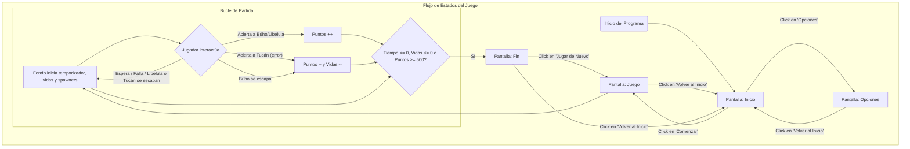
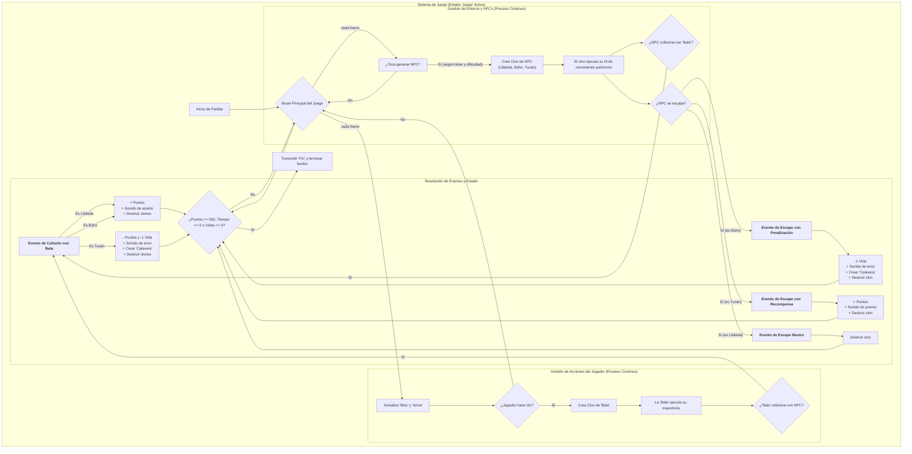

### ¿Qué ha cambiado en este diagrama?

1.  **Doble Salida de la IA:** El bloque `E[El clon ejecuta su IA...]` ahora tiene dos posibles salidas: `F[¿Colisiona con 'Bala'?]` y `G[¿Se escapa?]`. Esto es crucial porque tu juego ahora trata ambos eventos de forma diferente.
2.  **Resolución de Eventos Detallada:** El bloque de "Resolución" es mucho más rico:
    *   Ya no hay un genérico "Evento de Colisión". Ahora se ramifica según **el tipo de NPC** (`Libélula`, `Búho`, `Tucán`), mostrando las consecuencias únicas de cada colisión.
    *   Se ha añadido toda una nueva sección para los **Eventos de Escape**, mostrando también las diferentes consecuencias: la penalización del Búho, la recompensa del Tucán y la neutralidad de la Libélula.
3.  **Flujo de Consecuencias:** Todos los resultados (sumar puntos, restar vidas, etc.) ahora convergen en el bloque `V[Verificar Condición de Fin]`, que a su vez tiene la lógica actualizada (`>= 500 puntos`, `<= 0 vidas`, etc.).

Este nuevo diagrama es mucho más potente. Si se lo mostraras a otro programador, podría entender la esencia y la profundidad de tus mecánicas de juego sin necesidad de ver una sola línea de código. ¡Gran avance
### PANTALLA PRINCIPAL
- [x] Logo o título de juego
- [x] Se agregará botón de jugar
- [ ] Se agregará botón de leer reglas de juego (Instrucciones)
- [x] Botón de opciones
- [ ] Autor

### PANTALLA DE SELECCIÓN DE OPCIONES
- [x] Se agregará sección de dificultad
- [ ] Explicación de las dificultades
- [ ] Se pondrá selección de volumen global, sonido previo para comparar escucha, rotador de sonidos aleatorios
- [x] Botón para volver al menú
- [ ] Tengo que hacer un método para actualizar sonido

### PANTALLA DE JUEGO
- [x] Indicador de nivel de dificultad (la variable ya funciona e impacta el juego)
- [ ] Contador de puntos animado
- [ ] Timer animado
- [x] Indicador de vidas
- [x] Animación de vidas (los corazones y calaveras)
- [ ] Barra de vidas (si quieres un fondo para los corazones)
- [x] Se pondrá un sonido de vuelo a las libélulas (Aletear)
- [x] Se pondrá un sonido de disparo (Tennis Hit)
- [x] Se pondrá animación de golpe y salida de bala
- [x] Se pondrá sonido de muerte de libélula (Low Whoosh)
- [ ] Sonido de fallo de disparo (cuando se hace clic pero no se acierta)
- [x] Enemigo al que no dispararle y sus complementos derivados (Tucán)

### PANTALLA DE VICTORIA / DERROTA (Pantalla de Fin)
- [ ] Se agregará un personaje saltando y girando de izq a der con animación de fuegos artificiales y sonidos (para la victoria)
- [x] Se agregará sonido de pérdida de fondo (sonidos de victoria/derrota ya implementados)
- [x] Se pondrá un personaje triste (los NPCs llorando en el resumen)
- [ ] Se pondrá botón de reiniciar (Jugar de Nuevo) o salir (Volver al Inicio)
- [x] Mensaje de puntaje final
- [ ] Estadísticas rápidas (aciertos, fallos, precisión).

# To-Do
## NPC - Libelula
### Que hace?
- **Función principal:** El sprite original está oculto y actúa como un generador (spawner) de dos tipos de libélulas. También muestra el resumen de bajas en la pantalla final.

- **Generación de clones (Spawning):**
    - Únicamente durante el estado de "Juego", crea una nueva libélula cada medio segundo.
    - **NUEVO:** Al crear un clon, reproduce un sonido de aleteo para alertar al jugador.
    - Lleva un registro de cuántas libélulas se han creado en total.

- **Comportamiento de los clones:**
    - Al ser creada, cada libélula tiene una **probabilidad de 1 entre 25 de ser una variante Rara**.
    - **Libélula Normal (24/25 de probabilidad):**
        - Es de tamaño normal y tiene la animación de aleteo estándar.
        - Al ser destruida, otorga **+5 puntos**.
    - **NUEVO - Libélula Rara (1/25 de probabilidad):**
        - Es más pequeña, tiene un color/disfraz diferente y emite un sonido mágico al aparecer.
        - Al ser destruida, otorga una **recompensa especial**: **+5 puntos y +1 Vida**, creando un nuevo corazón en la interfaz.
    - **Comportamiento Común:**
        - Ambas variantes se mueven desde una posición aleatoria en la "línea de horizonte" hacia un destino aleatorio en la parte superior. Su velocidad de movimiento aumenta con la `Dificultad`.
        - **Decisión de Diseño:** Ninguna de las dos variantes resta vidas si se escapa.

- **Resumen de Fin de Partida:**
    - Muestra el recuento final de libélulas abatidas (de ambos tipos) versus las creadas.

### Que quiero que haga?
- **(Prioridad de Normalización)** Hacer que la **frecuencia de aparición** (el `time.sleep`) dependa de la variable `Dificultad`, para que escale de forma coherente con los otros NPCs.
- **(Mejora Técnica)** Cambiar el sonido de aparición de `play_until_done` a `play` para asegurar que el movimiento del clon no se retrase.

## NPC - Tucan
### Que hace?
- **Función principal:** Actúa como un NPC "sagrado" o "amigo". El objetivo del jugador es **NO dispararle**.

- **Generación de clones (Spawning):**
    - Crea un nuevo tucán en intervalos de tiempo aleatorios, cuya frecuencia y tamaño dependen de la `Dificultad`.
    - Lleva un registro de cuántos tucanes se han creado y cuántos han sido "abatidos" por error.

- **Comportamiento de cada tucán (clon):**
    - **Aparición y Trayectoria:**
        - Aparece a la izquierda y vuela horizontalmente, con un movimiento ondulatorio de zig-zag.
    - **Interacción (Penalización):**
        - Si el jugador le dispara, el tucán se destruye.
        - Penaliza duramente al jugador: le resta **25 puntos** y le quita **una vida**.
        - Reproduce un sonido de "cristal roto" para enfatizar el error.
        - **NUEVO:** Al ser destruido, crea un clon del sprite "Calavera" como un efecto visual adicional de la penalización.
    - **NUEVO - Interacción (Recompensa):**
        - Si el tucán logra cruzar la pantalla sano y salvo, **recompensa al jugador con +20 puntos**.

- **Resumen de Fin de Partida:**
    - Muestra un disfraz de "llorando" y un mensaje con el recuento de tucanes "abatidos" por error.

### Que quiero que haga?
- **(Prioridad de Pulido)** Añadir un sonido distintivo y "amigable" al aparecer.
- **(Prioridad de Gameplay)** Mejorar el patrón de movimiento de zig-zag para que se sienta más natural y menos predecible.
- **(Mejora Opcional)** Añadir un sonido de "recompensa" cuando el tucán escapa exitosamente.

## Boton - comenzar
### Que hace?
- Al iniciar el programa (bandera verde), el botón está oculto.
- Se muestra únicamente en la pantalla de "Inicio", posicionado en el centro.
- Cuando el puntero del mouse está sobre él y se hace clic:
    - Reproduce un sonido "pop".
    - Envía la señal para que el juego cambie al estado "Juego".
    - Se oculta y detiene su funcionamiento.
- Si se llega a la pantalla de "Opciones", el botón se asegura de permanecer oculto.

### Que quiero que haga?
<!-- Aquí puedes anotar tus próximas ideas para este sprite -->

## Boton - Opciones
### Que hace?
- Al iniciar el programa (bandera verde), el botón está oculto.
- Se muestra únicamente en la pantalla de "Inicio".
- Cuando el puntero del mouse está sobre él y se hace clic:
    - Reproduce un sonido "pop".
    - Envía la señal para cambiar a la pantalla de "Opciones".
    - Se oculta y detiene su funcionamiento.
- Permanece oculto en las pantallas de "Opciones" y "Juego".

### Que quiero que haga?
<!-- Aquí puedes anotar tus próximas ideas para este sprite -->
Deberia ponerse arriba sin ser clickable cuando entro a opciones y centrarse

## Sprite - Dificultad
### Que hace?
- Este sprite funciona como un elemento de la interfaz de usuario.
- Permanece oculto en todas las pantallas del juego ("Inicio", "Juego").
- Se muestra únicamente cuando el jugador entra en la pantalla de "Opciones".

### Que quiero que haga?
<!-- Aquí puedes anotar tus próximas ideas para este sprite -->

## Boton - Inicio
### Que hace?
- Funciona como un botón para "Volver al Menú Principal".
- Se muestra durante las pantallas de "Opciones", "Juego" y "Fin".
- Cuando el jugador hace clic en él, envía la señal para volver a la pantalla de "Inicio".
- Permanece oculto en la pantalla de "Inicio" para evitar redundancia.

### Que quiero que haga?
<!-- Aquí puedes anotar tus próximas ideas para este sprite -->

## Fondo (Stage)
### Que hace?
- **Función principal:** Actúa como el controlador central del juego, gestionando los estados, variables globales y la lógica principal de la partida.

- **Al iniciar (Bandera Verde):**
    - Inicializa variables globales y lanza el evento "Inicio".

- **Gestión de Pantallas:**
    - Cambia la imagen del fondo para que coincida con el estado actual del juego.

- **Lógica del Juego (al recibir "Juego"):**
    - **Inicialización de la partida:**
        - Pone a cero los `Puntos`.
        - **NUEVO:** Inicializa la variable `Balas disparadas` a 0, preparando el sistema de precisión.
        - **NUEVO - Sistema de Vidas Modular:**
            - Establece `Vidas iniciales` en 3.
            - Calcula `Vidas totales` sumando las `Vidas iniciales` y las `Vidas extra` (obtenidas de las libélulas raras).
        - Reinicia el `Tiempo Partida`.
    - **Monitorea Múltiples Condiciones de Fin de Partida:**
        1.  **Victoria:** Si el jugador, **NUEVO**, alcanza **500 Puntos**, emite la señal de "Fin".
        2.  **Derrota por Tiempo:** Si el temporizador llega a 0, emite la señal de "Fin".
        3.  **Derrota por Vidas:** Si las `Vidas totales` llegan a 0, emite la señal de "Fin".

- **Pantalla de Fin (al recibir "Fin"):**
    - Muestra un fondo específico dependiendo de la causa del final.
    - Calcula un `Puntaje final` complejo que premia la eficiencia del jugador.
    - Prepara la lógica para mostrar el resumen de estadísticas de la partida.

### Que quiero que haga?
<!--
- Implementar el cálculo y la visualización de la Precisión en la pantalla de Fin, usando la variable 'Balas disparadas'.
-->

#### 1. Mecánicas de Juego Fundamentales

- [ ] **Sistema de Precisión:**
    - [ ] Crear variable global `balas_disparadas` e incrementarla al disparar.
    - [ ] Calcular la precisión (`bajas / disparos`) en la pantalla de `Fin`.
    - [ ] Mostrar el porcentaje de precisión en el resumen final.

#### 2. Flujo de Juego y Experiencia de Usuario

- [ ] **Pantalla Final (Fin):**
    - [ ] Añadir un botón funcional de **"Jugar de Nuevo"** que reinicie la partida emitiendo la señal `Juego`.
- [ ] **Pantallas de Menú:**
    - [ ] Crear un nuevo fondo (`backdrop`) para las **"Instrucciones"**.
    - [ ] Añadir un botón en la pantalla de `Inicio` que lleve a las "Instrucciones".
    - [ ] Añadir un botón en "Instrucciones" para volver a `Inicio`.
    - [ ] Crear un nuevo fondo (`backdrop`) para los **"Créditos"**.
    - [ ] Añadir un botón en la pantalla de `Inicio` u `Opciones` que lleve a los "Créd
    - [ ] Añadir un botón en "Créditos" para volver a `Inicio`.

# Hoja de Ruta del Proyecto
# ✅ Checklist Maestra Unificada (Recta Final v1.0)

### 🎯 Prioridad 1: Completar el Bucle de Gameplay Esencial
*(Tareas que definen si se puede jugar de principio a fin con todas las reglas claras)*

- **Sistema de Precisión y Recarga de Arma:**
    - Implementar el contador `Balas disparadas`.
    - Añadir la mecánica de **recarga** cada 6 disparos (usando el módulo).
    - Crear la animación y el sonido de recarga, y la lógica para que no se pueda disparar durante ella.
- **Pantalla de Estadísticas Finales:**
    - Calcular y mostrar la **precisión** del jugador (`bajas / disparos * 100`).
    - Mostrar el **Puntaje Final** y las bajas de cada tipo de NPC.
- **Botones de Flujo de Juego:**
    - Añadir y programar el botón **"Jugar de Nuevo"** en la pantalla de Fin.
    - Añadir y programar el botón **"Instrucciones"** en el menú principal.
    - Añadir y programar el botón **"Créditos"** y poner tu nombre/enlace a GitHub.

### ✨ Prioridad 2: Pulido de NPCs y Feedback al Jugador
*(Tareas que hacen que el juego se sienta vivo, justo y profesional)*

- **Pulido del Tucán:**
    - Mejorar el patrón de movimiento del zig-zag (con aleatoriedad o una curva sinusoidal).
    - Añadirle un sonido de aparición "amigable" para diferenciarlo.
    - Añadirle un sonido de "recompensa" cuando escapa exitosamente.
- **Pulido de la Libélula:**
    - Ajustar la frecuencia de aparición para que dependa de la `Dificultad`.
- **Efectos Visuales ("Game Feel"):**
    - Implementar el efecto **"Hit Flash"** (el enemigo parpadea en blanco al ser golpeado) para un mejor feedback de impacto.

### ⚖️ Prioridad 3: Balance Final y Refinamiento Estético
*(Tareas de ajuste fino que se hacen cuando todo lo demás ya funciona)*

- **Balance de Dificultad:**
    - Revisar y ajustar las fórmulas de frecuencia de aparición y velocidad de todos los NPCs para que el juego escale bien de dificultad 1 a 5.
- **Balance de Puntuación:**
    - Revisar y ajustar la fórmula del `Puntaje Final` para que los valores que arroja se sientan justos y gratificantes.
- **Animaciones de la Interfaz:**
    - Añadir animaciones a los contadores de puntos y tiempo para que no sean estáticos.
    - Añadir la animación del "personaje victorioso" en la pantalla de Fin.
- **Organización del Código (Refactorización final):**
    - Revisar todos los sprites y ordenar las variables.
    - Asegurarse de que los nombres de las variables sean claros y consistentes.
    - Añadir comentarios finales donde la lógica sea especialmente compleja.

# Cerrado sin idea de modificar
# To-Do
## NPC - Buho
### Que hace?
- **Función principal:** Actúa como la **amenaza principal** del juego. El sprite original está oculto y gestiona la generación de clones y el resumen final.

- **Generación de clones (Spawning):**
    - Crea clones de búho en intervalos de tiempo aleatorios.
    - La frecuencia de aparición aumenta con la `Dificultad`.
    - Lleva un registro de cuántos búhos se han creado.

- **Comportamiento de cada búho (clon):**
    - **Aparición y movimiento:**
        - Aparece en una posición aleatoria y realiza un "salto" con una velocidad inicial variable, siguiendo una curva de gravedad.
        - Reproduce un sonido de búho (`Owl`) al aparecer.
    - **Animación:**
        - Cambia de disfraz para reflejar cada fase de su movimiento: salto, caída y una animación de "burla" en el aire.
    - **Interacción (Destrucción):**
        - Si es tocado por la 'Bala', se destruye.
        - Otorga **+10 puntos** y reproduce un sonido de "muerte" (`Chirp`).
    - **NUEVO - Interacción (Escape / Penalización):**
        - Si el búho completa su salto y cae por debajo de la pantalla (se escapa), **penaliza al jugador quitándole una vida**.
        - El escape se comunica con un sonido (`Low Boing`) y la aparición de un sprite de "Calavera".

- **Resumen de Fin de Partida:**
    - Muestra un disfraz de "llorando" y un mensaje con el recuento de búhos abatidos versus los creados.

## Boton - Dificultad
### Que hace?
- **Función principal:** Gestiona el ajuste del nivel de dificultad del juego.
- **Comportamiento general:**
    - Solo se muestra en la pantalla de "Opciones". Permanece oculto en todas las demás.
    - Al aparecer, se divide en dos botones:
        1.  El sprite original se convierte en el botón para **"Aumentar"** la dificultad y se posiciona a la izquierda.
        2.  Inmediatamente crea un clon de sí mismo, que se convierte en el botón para **"Disminuir"** la dificultad y se posiciona a la derecha.
    - **NUEVO:** Se han reposicionado los botones en la parte superior de la pantalla (`y = 70`).

- **Funcionalidad de los botones:**
    - **Botón Aumentar (+):**
        - Al hacer clic, incrementa la variable "Dificultad" en 1.
        - El nivel máximo de dificultad es 5. Si se intenta superar, muestra un mensaje de advertencia.
    - **Botón Disminuir (-):**
        - Al hacer clic, reduce la variable "Dificultad" en 1.
        - El nivel mínimo de dificultad es 1. Si se intenta bajar más, muestra un mensaje de advertencia.
    - **Feedback:** Después de cada cambio, muestra el nuevo valor de dificultad por un momento.

## Arma
### Que hace?
- Al iniciar el programa (bandera verde), el arma permanece oculta.
- No aparece en las pantallas de "Inicio" ni de "Fin".
- Su comportamiento principal se activa únicamente durante el "Juego":
    - Se hace visible.
    - **NUEVO:** Se asegura de aparecer siempre en la capa superior (por encima de los enemigos).
    - Sigue la posición del cursor, pero con un desplazamiento fijo (aparece abajo y a la derecha del puntero).
    - Siempre apunta en la dirección del mouse.
    - Al hacer clic con el mouse:
        - Dispara (crea un clon del sprite "Bala").
        - Realiza una pequeña animación de retroceso inclinándose.
        - Espera a que se suelte el botón del mouse antes de volver a su posición original.

## Sprite - Mira
### Que hace?
- **Función principal:** Actúa como el cursor principal del jugador, cambiando su apariencia y comportamiento según el estado del juego.

- **Comportamiento por estado:**
    - **En `Inicio` y `Fin` (Menús):**
        - Se muestra.
        - Se transforma en una "Estrella".
        - Sigue continuamente al puntero del mouse.
        - Gira constantemente, actuando como un cursor decorativo.
    - **En `Juego` (Partida):**
        - Se muestra.
        - Se asegura de apuntar en una dirección fija (90 grados) para evitar rotaciones no deseadas.
        - Se transforma en una "Mira de Arma" funcional.
        - Sigue continuamente al puntero del mouse de forma precisa.
    - **En `Opciones`:**
        - Hereda el comportamiento de la pantalla de `Inicio`, manteniendo la coherencia del cursor en los menús.

## Sprite - Corazon (UI Vidas)
### Que hace?
- **Función principal:** Actúa como el sistema visual que representa las vidas del jugador. El sprite original está oculto y se encarga de generar los clones de corazón.

- **Generación de clones (al recibir "Juego"):**
    - El sprite principal se prepara en la esquina superior de la pantalla.
    - **NUEVO:** Crea un clon por cada vida que tiene el jugador, con una pequeña pausa entre cada uno, creando una animación de "llenado" de la barra de vidas.

- **Comportamiento de cada clon de corazón:**
    - **Aparición:**
        - Se posiciona en la pantalla, espaciado correctamente de los otros corazones.
        - **NUEVO:** Reproduce un sonido `pop` al aparecer.
        - **NUEVO:** Realiza una pequeña animación de "salto" y crecimiento al ser creado.
    - **NUEVO - Animaciones Continuas:**
        - Una vez en pantalla, cada corazón entra en un bucle donde se anima constantemente, "tambaleándose" y dando pequeños saltos para que la interfaz se sienta viva.
    - **NUEVO - Lógica de Destrucción Visual:**
        - Cada corazón ahora está "atento" a si toca un sprite de "Calavera".
        - Si un "Sprite - Calavera" (generado por un error del jugador) lo toca, el corazón se autodestruye.
    - **Limpieza de Partida:**
        - Los clones se autodestruyen si el juego vuelve a la pantalla de "Inicio" o "Fin", dejando el escenario limpio para la siguiente partida.

## Sprite - Calavera (UI Efecto de Daño)
### Que hace?
- **Función principal:** Actúa como un **indicador visual permanente** de las vidas perdidas. El sprite original permanece siempre oculto.

- **Generación de clones:**
    - Un clon de este sprite se crea cada vez que el jugador comete un error que le cuesta una vida.

- **Comportamiento de cada clon de Calavera:**
    - **Aparición Inteligente:**
        - Aparece directamente sobre la interfaz de vidas.
        - Utiliza las mismas variables que el sprite de corazones para calcular su posición, apareciendo **exactamente sobre el último corazón de la fila**.
    - **Animación y Sonido de Aparición:**
        - Se hace visible, reproduce un sonido de error (`Oops`).
        - Realiza una animación de crecimiento para atraer la atención del jugador.
    - **Lógica de "Reemplazo":**
        - Su aparición sobre un `Sprite - Corazon` activa la lógica de destrucción de ese corazón.
    - **NUEVO - Decisión de Diseño:**
        - La calavera **no se autodestruye**. Permanece en la pantalla por el resto de la partida, actuando como un recordatorio visual y permanente del error cometido.

## Bala
### Que hace?
- **Función principal:** El sprite original actúa como una "plantilla". La lógica principal se ejecuta en sus clones.
- **Decisión de diseño:** Se mantiene una única arma para enfocar el gameplay.

- **Comportamiento de cada clon (cuando se dispara):**
    - **NUEVO - Conteo de Disparos:**
        - Al ser creado, incrementa la variable global `Balas disparadas` en 1. Este contador será usado para el sistema de precisión y la mecánica de recarga.
    - **Aparición y Trayectoria:**
        - Se posiciona en el 'Arma' y apunta hacia el mouse.
        - Se desliza rápidamente hasta el destino, activando la `Bandera de disparo` por un breve momento para permitir la colisión.
    - **Impacto y desaparición:**
        - Entra en un bucle donde su tamaño se reduce progresivamente hasta que desaparece, creando un efecto de impacto.
