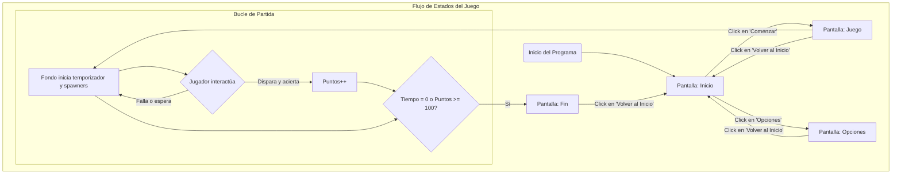

```mermaid
flowchart TD
    subgraph "Sistema de Juego (Estado 'Juego' Activo)"
        A[Inicio de Partida] --> B{Bucle Principal del Juego};
        
        subgraph "Gestión de Entorno y NPCs (Proceso Continuo)"
            B -- cada frame --> C[¿Toca generar NPC?];
            C -- Sí (según timer y dificultad) --> D["Crea Clon de NPC <br> (Libelula, Buho, Tucan)"];
            D --> E[El clon ejecuta su IA de movimiento autónomo];
            E --> F{¿NPC colisiona con 'Bala'?};
            C -- No --> B;
        end

        subgraph "Gestión de Acciones del Jugador (Proceso Continuo)"
            B -- cada frame --> G[Actualiza posición de 'Mira' y 'Arma'];
            G --> H{¿Jugador hace clic?};
            H -- Sí --> I[Crea Clon de 'Bala'];
            I --> J[La 'Bala' ejecuta su trayectoria];
            J --> K{¿'Bala' colisiona con NPC o sale de pantalla?};
            H -- No --> B;
        end
        
        subgraph "Resolución de Interacciones y Estado"
            F -- Sí --> L[<b>Evento de Colisión</b>];
            K -- Sí --> L;
            L --> M["+ Incrementar Puntos <br> + Reproducir Sonido <br> + Destruir Clones (Bala y NPC)"];
            M --> N[Verificar Condición de Fin];
            
            K -- No --> J;
            F -- No --> E;
            
            B --> N;
        end
        
        N{¿Puntos >= 100 o Tiempo <= 0?} -- Sí --> O[Transmitir 'Fin' y terminar bucle];
        N -- No --> B;
    end
 ```

    PANTALLA PRINCIPAL
    Logo o titulo de juego
    Se agregará boton de jugar
    Se agregará botón de leer reglas de juego
    Boton de opciones
    Autor
  
    PANTALLA DE SELECCIÓN DE OPCIONES
    Se agregará sección de dificultad, explicación de ellas
    Se pondrá selección de volumen global, sonido previo para comparar escucha, rotador de sonidos aleatorios
    Boton para volver al menú
    Tengo que hacer un metodo actualizar sonido

    PANTALLA DE JUEGO
    Indicador de nivel de dificultad
    Contador de puntos animado
    Timer animado
    Indicador de vidas
    Animación de vidas
    Barra de vidas
    Se pondra un sonido de vuelo a las libelulas
    Se pondra un sonido de disparo
    Se pondra nimacion de golpe y salida de bala
    Se pondra sonido de muerte de libelula
    Sonido de fallo de disparo
    Enemigo al que no dispararle y sus complementos derivados

    PANTALLA DE VICTORIA
    Se agregara un personaje saltando y girando de izq a der conanimación de fuegos artificiales y sonidos
    Se pondrá botón de reiniciar o salir
    Se pondrá boton de siguiente dificultad
    Mensaje de puntaje final
    Estadísticas rápidas (aciertos, fallos, precisión).

    PANTALLA DE DERROTA
    Se agregara un sonido de golpe 
    Se agregará sonido de perdida de fondo
    Se pondra un personaje triste
    Se pondrá Boton de reiniciar o salir
    Se pondrá boton de anterior dificultad
    Mensaje de puntaje final
    Estadísticas rápidas (aciertos, fallos, precisión).
# To-Do
## Sprite - Mira
### Que hace?
- Gira
- Se actualiza para diferentes espacios
    - Inicio:
        - Se muestra
        - Detiene los otros procesos
        - Se transforma en estrella
        - Sigue al mouse
        - Gira
    - Opciones: No es necesario mismo comportamiento de inicio y opciones depende de inicio
    - Juego:
        - Apunta en dirección correcta, porque antes estaba girando
        - Se muestra
        - Detiene los otros procesos
        - Se transforma en mirilla
        - Sigue al mouse
    - Fin

## NPC - Libelula
### Que hace?
- **Función principal:** El sprite original está oculto y actúa como un "generador" de enemigos.

- **Generación de clones (Spawning):**
    - Únicamente durante el estado de "Juego", crea una nueva libélula (un clon) cada medio segundo.
    - Este proceso se detiene si el juego termina o vuelve al inicio.

- **Comportamiento de cada libélula (clon):**
    - **Aparición y movimiento:**
        - Aparece en una posición horizontal aleatoria sobre una "línea de horizonte".
        - Se le asigna un destino final aleatorio en la parte superior de la pantalla.
        - Se desliza suavemente en línea recta hacia su destino.
        - Su velocidad aumenta según el nivel de "Dificultad".
    - **Animación:**
        - Aletea constantemente, cambiando entre varios disfraces para simular el vuelo.
    - **Interacción y destrucción:**
        - Si es tocada por el sprite "Bala", se destruye.
        - Al ser destruida, añade 5 puntos al marcador y reproduce un sonido.
        - Los clones también se eliminan si el juego sale del estado "Juego".

### Que quiero que haga?
<!-- Aquí puedes anotar tus próximas ideas para este sprite -->

## Arma
### Que hace?
- Al iniciar el programa (bandera verde), el arma permanece oculta.
- No aparece en las pantallas de "Inicio" ni de "Fin".
- Su comportamiento principal se activa únicamente durante el "Juego":
    - Se hace visible.
    - Sigue la posición del cursor, pero con un desplazamiento fijo (aparece abajo y a la derecha del puntero).
    - Siempre apunta en la dirección del mouse.
    - Al hacer clic con el mouse:
        - Dispara (crea un clon del sprite "Bala").
        - Realiza una pequeña animación de retroceso inclinándose.
        - Espera a que se suelte el botón del mouse antes de volver a su posición original.

### Que quiero que haga?
<!-- Aquí puedes anotar tus próximas ideas para este sprite -->

## Bala
### Que hace?
- **Función principal:** El sprite original actúa como una "plantilla" que permanece oculta y fuera de la pantalla durante el juego. La lógica principal se ejecuta en sus clones.

- **Comportamiento de cada clon (cuando se dispara):**
    - **Aparición:**
        - Se crea en la misma posición que el sprite "Arma".
        - Apunta en la dirección del mouse en el momento del disparo.
        - Captura las coordenadas exactas del mouse para usarlas como su destino.
    - **Trayectoria:**
        - Se hace visible y reproduce un sonido de disparo.
        - Se desliza rápidamente (en 0.25 segundos) hasta la posición de destino que capturó.
        - Mientras viaja, activa una variable ("Bandera de disparo") para que los enemigos sepan que pueden ser impactados.
    - **Impacto y desaparición:**
        - Al llegar a su destino, desactiva la "Bandera de disparo".
        - Entra en un bucle donde su tamaño se reduce progresivamente hasta que desaparece, creando un efecto de impacto.
        - (El clon se autodestruye después de su animación).

### Que quiero que haga?
<!-- Aquí puedes anotar tus próximas ideas para este sprite -->

## Boton - comenzar
### Que hace?
- Al iniciar el programa (bandera verde), el botón está oculto.
- Se muestra únicamente en la pantalla de "Inicio", posicionado en el centro.
- Cuando el puntero del mouse está sobre él y se hace clic:
    - Reproduce un sonido "pop".
    - Envía la señal para que el juego cambie al estado "Juego".
    - Se oculta y detiene su funcionamiento.
- Si se llega a la pantalla de "Opciones", el botón se asegura de permanecer oculto.

### Que quiero que haga?
<!-- Aquí puedes anotar tus próximas ideas para este sprite -->

# To-Do
## Sprite - Boton - Opciones
### Que hace?
- Al iniciar el programa (bandera verde), el botón está oculto.
- Se muestra únicamente en la pantalla de "Inicio".
- Cuando el puntero del mouse está sobre él y se hace clic:
    - Reproduce un sonido "pop".
    - Envía la señal para cambiar a la pantalla de "Opciones".
    - Se oculta y detiene su funcionamiento.
- Permanece oculto en las pantallas de "Opciones" y "Juego".

### Que quiero que haga?
<!-- Aquí puedes anotar tus próximas ideas para este sprite -->
Deberia ponerse arriba sin ser clickable cuando entro a opciones y centrarse

## Sprite - Dificultad
### Que hace?
- Este sprite funciona como un elemento de la interfaz de usuario.
- Permanece oculto en todas las pantallas del juego ("Inicio", "Juego").
- Se muestra únicamente cuando el jugador entra en la pantalla de "Opciones".

### Que quiero que haga?
<!-- Aquí puedes anotar tus próximas ideas para este sprite -->

## Boton - Inicio
### Que hace?
- Funciona como un botón para "Volver al Menú Principal".
- Se muestra durante las pantallas de "Opciones", "Juego" y "Fin".
- Cuando el jugador hace clic en él, envía la señal para volver a la pantalla de "Inicio".
- Permanece oculto en la pantalla de "Inicio" para evitar redundancia.

### Que quiero que haga?
<!-- Aquí puedes anotar tus próximas ideas para este sprite -->

## Boton - Dificultad
### Que hace?
- **Función principal:** Gestiona el ajuste del nivel de dificultad del juego.
- **Comportamiento general:**
    - Solo se muestra en la pantalla de "Opciones". Permanece oculto en todas las demás.
    - Al aparecer, se divide en dos botones:
        1.  El sprite original se convierte en el botón para **"Aumentar"** la dificultad y se posiciona a la izquierda.
        2.  Inmediatamente crea un clon de sí mismo, que se convierte en el botón para **"Disminuir"** la dificultad y se posiciona a la derecha.

- **Funcionalidad de los botones:**
    - **Botón Aumentar (+):**
        - Al hacer clic, incrementa la variable "Dificultad" en 1.
        - El nivel máximo de dificultad es 5. Si se intenta superar, muestra un mensaje de advertencia.
    - **Botón Disminuir (-):**
        - Al hacer clic, reduce la variable "Dificultad" en 1.
        - El nivel mínimo de dificultad es 1. Si se intenta bajar más, muestra un mensaje de advertencia.
    - **Feedback:** Después de cada cambio, muestra el nuevo valor de dificultad por un momento.

### Que quiero que haga?
<!-- Aquí puedes anotar tus próximas ideas para este sprite -->

## NPC - Buho
### Que hace?
- **Función principal:** El sprite original está oculto y actúa como un generador (spawner) de búhos enemigos.

- **Generación de clones (Spawning):**
    - Únicamente durante el estado de "Juego", entra en un bucle para crear clones.
    - El tiempo de espera entre la aparición de cada búho es aleatorio.
    - A mayor nivel de "Dificultad", menor es el tiempo de espera, haciendo que los búhos aparezcan con más frecuencia.
    - El proceso de generación se detiene si el juego ya no está en el estado "Juego".

- **Comportamiento de cada búho (clon):**
    - **Aparición y movimiento:**
        - Aparece en una posición horizontal aleatoria sobre una "línea de horizonte".
        - Inmediatamente realiza un "salto" hacia arriba con una velocidad vertical inicial.
        - Después del salto, es afectado por una gravedad constante que lo hace acelerar hacia abajo.
        - Cae hasta desaparecer por debajo de la "línea de horizonte", momento en el que se autodestruye.
    - **Limpieza:**
        - Si el estado del juego deja de ser "Juego" (por ejemplo, al volver al inicio), todos los clones de búho en pantalla se eliminan.

### Que quiero que haga?
<!-- Aquí puedes anotar tus próximas ideas para este sprite -->
Debo agregar colisiones y sonidos


## NPC - Tucan
### Que hace?
- **Función principal:** El sprite original está oculto y actúa como un generador (spawner) de tucanes.

- **Generación de clones (Spawning):**
    - Únicamente durante el estado de "Juego", crea un nuevo tucán (clon) en intervalos de tiempo aleatorios.
    - A mayor nivel de "Dificultad", los tucanes aparecen con más frecuencia.
    - El proceso se detiene si el juego ya no está en el estado "Juego".

- **Comportamiento de cada tucán (clon):**
    - **Aparición y Trayectoria:**
        - Aparece fuera de la pantalla a la izquierda, en una altura aleatoria.
        - Vuela horizontalmente hacia la derecha a través de la pantalla.
        - Crea un efecto de perspectiva: empieza pequeño y crece rápidamente al entrar en la pantalla, luego mantiene un tamaño fijo.
    - **Movimiento Vertical y Animación:**
        - Una vez en pantalla, realiza un movimiento ondulatorio o de zig-zag: aletea para subir un poco y luego planea hacia abajo una distancia mayor.
        - La animación de las alas (cambio de disfraz) está sincronizada con este movimiento.
    - **Interacción:**
        - Actualmente, solo implementa la lógica de movimiento. **No tiene colisiones** con la 'Bala' ni otorga puntos.
        - Se autodestruye si vuela fuera del borde derecho de la pantalla o si el juego termina.

### Que quiero que haga?
- Implementar la lógica de colisión para que pueda ser destruido por la 'Bala'.
- Añadir la funcionalidad de otorgar puntos al ser destruido.
- **(Prioridad)** Reemplazar el actual movimiento de zig-zag por un sistema de 'saltos' y gravedad, similar al del Búho, para un movimiento más físico y menos predecible.

## Fondo (Stage)
### Que hace?
- **Función principal:** Actúa como el controlador central del juego, gestionando los diferentes estados (pantallas) y la lógica principal de la partida.

- **Al iniciar (Bandera Verde):**
    - Inicializa todas las variables de estado ("Banderas") a cero.
    - Establece la dificultad por defecto en 1.
    - Lanza el evento "Inicio" para mostrar el menú principal.

- **Gestión de Pantallas:**
    - Recibe eventos ("Inicio", "Opciones", "Juego", "Fin") y cambia la imagen del fondo para que coincida con el estado actual del juego.

- **Lógica del Juego (al recibir "Juego"):**
    - Inicializa las variables de la partida: define los límites de la pantalla, la línea del horizonte para los enemigos y resetea los puntos a 0.
    - Inicia un temporizador de 30 segundos.
    - Monitorea dos condiciones de fin de partida simultáneamente:
        1.  **Victoria:** Si el jugador alcanza 100 puntos, emite la señal de "Fin".
        2.  **Derrota:** Si el temporizador llega a 0, emite la señal de "Fin".
    - Si se sale de la pantalla de juego, estos procesos se detienen.

- **Función sin usar:**
    - Contiene una función llamada `Reset_de_Estado` que parece diseñada para gestionar o limpiar las variables de estado ("Banderas"), pero actualmente no es llamada por ningún evento.

### Que quiero que haga?
<!-- Aquí puedes anotar tus próximas ideas para el Fondo -->

# Hoja de Ruta del Proyecto

### Parte 1: Tareas Fundamentales (Lo Necesario para una Versión 1.0 Completa)
*Estas son las prioridades. Completa estas tareas para tener un juego funcional, pulido y terminado en su ciclo principal. Te recomiendo hacerlas en este orden.*

#### Completar la Mecánica Central de Juego:
- **Implementar colisiones para el Búho y el Tucán:** La tarea más crítica. Sin esto, no son enemigos, son decoración.
- **Crear contadores para cada tipo de enemigo:** Necesitas variables separadas (`libelulas_derrotadas`, `buhos_derrotados`, etc.) que se incrementen al colisionar.
- **Calcular el puntaje total:** Usa los contadores para asignar diferentes puntos por enemigo (ej: Libélula=5, Búho=10, Tucán=15) y sumarlos a la variable `Puntos`.
- **Refactorizar el movimiento del Tucán:** Implementa el sistema de gravedad que querías en lugar del zig-zag.

#### Pulido y Feedback (Audio y Video):
- **Añadir sonidos a los NPCs:** Asigna un sonido de aparición y de destrucción a cada enemigo nuevo. Esto da una satisfacción inmensa al jugador.
- **Revisar y sincronizar animaciones:** Asegúrate de que las animaciones de aleteo o salto de los nuevos NPCs se vean fluidas y naturales.

#### Completar el Flujo del Juego:
- **Mostrar el puntaje final:** En la pantalla de "Fin", muestra un texto claro con el puntaje total que el jugador consiguió.
- **Crear una pantalla de "Créditos":** Un nuevo estado/fondo que aparezca desde el menú de inicio o de opciones. Es fundamental para profesionalizar tu proyecto.
- **Añadir un enlace a tu GitHub en los Créditos:** Para que puedas mostrar tu trabajo y tu código.

---

### Parte 2: Ideas de Expansión (Lo Opcional para una Versión 2.0)
*Una vez que la Parte 1 esté terminada y pulida, puedes empezar a añadir estas características que le darán una profundidad increíble al juego.*

#### Nuevas Mecánicas de Jugador:
- **Sistema de Vidas:** Además del temporizador, el jugador podría tener 3 vidas y perder una si un enemigo llega a la parte inferior de la pantalla.
- **Múltiples Armas (Pistola / Escopeta):**
    - **Pistola:** La actual. Disparo rápido y preciso.
    - **Escopeta:** Disparo más lento pero que lanza varias "balas" en un cono, ideal para limpiar grupos de enemigos a corta distancia.
- **Sistema de Combos:** Si el jugador acierta a varios enemigos seguidos sin fallar un tiro, un multiplicador de puntos se activa (x1, x2, x3...).

#### Mejoras de Interfaz y Progresión:
- **Barra de Puntos Animada:** En lugar de solo un número, una barra que se va llenando hasta los 100 puntos.
- **Sistema de Desbloqueo:** La escopeta podría desbloquearse automáticamente la primera vez que el jugador llega a la pantalla de "Fin". El juego podría guardar una variable en un archivo para recordar que ya está desbloqueada.
- **Tienda en el Juego:** Usar los puntos ganados como moneda para comprar mejoras (más tiempo, una vida extra, etc.) desde la pantalla de "Inicio".

---

### Parte 3: Sugerencias Adicionales (Más Ideas para el Futuro)
*Aquí te dejo algunas ideas extra, basadas en lo que ya has construido, para "motivar la llama":*

#### Enemigos Especiales (Variantes):
- **La Libélula Dorada:** Una libélula que aparece muy de vez en cuando, es mucho más rápida que las normales, pero si logras acertarle, te da una cantidad enorme de puntos (ej: 50 puntos). Es fácil de implementar (cambiar color, velocidad y puntos) y añade mucha emoción.

#### Power-Ups:
- Crea un nuevo sprite que aparezca ocasionalmente. Si le disparas, te da una ventaja temporal:
    - **Reloj (Slow-Motion):** Ralentiza a todos los enemigos en pantalla durante 5 segundos.
    - **Estrella (Disparo Triple):** Durante 10 segundos, tu arma dispara tres balas a la vez.

#### Persistencia de Puntuación (High Score):
- **Guarda la puntuación más alta** en un archivo de texto. En la pantalla de "Inicio" y "Fin", muestra siempre el "High Score" actual. Esto da al jugador una razón para volver a jugar e intentar superar su propio récord. Es un desafío de programación muy interesante.

#### Mejoras de "Game Feel":
- **Screen Shake (Sacudida de pantalla):** Cuando un enemigo es destruido, haz que la pantalla tiemble ligeramente por una fracción de segundo. Es un efecto sutil que hace que los impactos se sientan mucho más potentes.
- **Efecto de "Hit Flash":** Cuando una bala le da a un enemigo, haz que el enemigo parpadee en blanco por un instante antes de desaparecer.