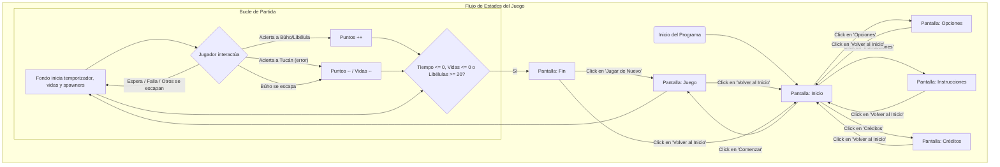
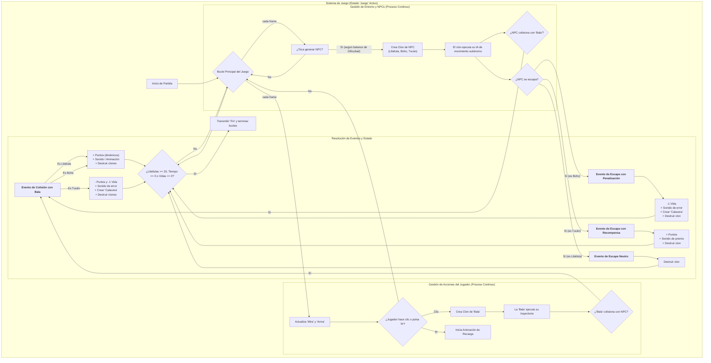

### PANTALLA PRINCIPAL
- [x] Logo o título de juego
- [x] Se agregará botón de jugar
- [x] Se agregará botón de leer reglas de juego (Instrucciones)
- [x] Botón de opciones
- [x] Autor (se añade en la pantalla de Créditos)
- [ ] link git
- 
### PANTALLA DE SELECCIÓN DE OPCIONES
- [x] Se agregará sección de dificultad
- [x] Botón para volver al menú

### PANTALLA DE JUEGO
- [x] Indicador de nivel de dificultad (impacta en el juego)
- [ ] Contador de puntos animado
- [x] Timer animado (el temporizador digital ya está hecho)
- [x] Indicador de vidas
- [x] Animación de vidas (los corazones y calaveras)
- [x] Contador de objetivo de Libélulas
- [x] Contador visual de munición
- [x] Sonido de disparo
- [x] Animación de golpe y salida de bala
- [x] Sonido de muerte para todos los NPCs
- - [x] Enemigo al que no dispararle (Tucán)

### PANTALLA DE FIN (VICTORIA / DERROTA)
- [ ] Animación de victoria (personaje saltando, fuegos artificiales, etc.)
- [x] Sonidos de victoria/derrota
- [x] Personajes tristes en el resumen
- [x] Se pondrá botón de reiniciar (Jugar de Nuevo) y salir (Volver al Inicio)
- [x] Mensaje de puntaje final
- [x] Estadísticas rápidas (precisión y bajas ya están implementadas)

# To-Do
## Arma
### Que hace?
- **Función principal:** Actúa como la herramienta principal de interacción del jugador, gestionando el disparo y la mecánica de recarga.
- **Inicialización:** Al iniciar el programa, el arma permanece oculta y define el tamaño del cargador en 6 balas. Al iniciar cada partida (`Juego`), resetea el contador de balas del cargador actual a 0.
- **Comportamiento en Juego:**
    - Se hace visible en la capa superior y sigue al puntero del mouse con un desplazamiento fijo.
    - Al hacer clic, dispara una `Bala` y realiza una animación de retroceso.
- **Sistema de Recarga Táctica (Automática y Manual):**
    - **Recarga Automática:** Después de disparar la 6ª bala, el arma activa automáticamente una secuencia de recarga.
    - **Recarga Manual:** El jugador puede pulsar la tecla **'R'** en cualquier momento para iniciar una recarga táctica.
    - **Feedback:** La recarga tiene una animación visual y un sonido distintivo, creando una pausa que impide disparar. Al finalizar, resetea el contador de `Balas - En cargador` a 0.
- **Decisión de Diseño:** El juego se centrará en una única arma.

## Sprite - Dificultad (UI)
### Que hace?
- **Función principal:** Actúa como un elemento visual estático (probablemente un título o un fondo) para la pantalla de "Opciones".
- **Comportamiento:**
    - Permanece oculto en todas las pantallas del juego (`Inicio`, `Juego`, `Fin`, etc.).
    - Se hace visible únicamente cuando el jugador entra en la pantalla de `Opciones`, sirviendo como un indicador de esa sección de la interfaz.

## Fondo (Stage)
### Que hace?
- **Función principal:** Actúa como el controlador central del juego, gestionando los estados, las variables globales y la lógica principal de la partida.
- **Inicialización (`greenflag`):**
    - Define todas las variables "constantes" del juego, como los límites del escenario, las posiciones de los menús y el objetivo de bajas para ganar (`Objetivo - libelulas` = 20).
    - Define las variables de "sesión", como la `Dificultad` por defecto, el volumen, y emite el `broadcast` inicial para mostrar la pantalla de `Inicio`.
- **Gestión de Pantallas:**
    - Cambia la imagen del fondo para que coincida con el estado actual del juego.
- **Lógica de Partida:**
    - **Balance Dinámico del Tiempo:** La duración total de la partida (`Tiempo Total`) ahora depende de la dificultad, disminuyendo en los niveles más altos para aumentar el desafío (de 60s en D1 a 40s en D5).
    - **Inicialización de Partida:** Al recibir `Juego`, resetea todas las variables de la partida (puntos, vidas, balas, tiempo).
- **Condiciones de Fin de Partida:** Monitorea y finaliza la partida si ocurre alguna de estas condiciones:
    1.  **Victoria:** El jugador derrota a 20 libélulas.
    2.  **Derrota por Tiempo:** El temporizador llega a cero.
    3.  **Derrota por Vidas:** El jugador pierde todas sus vidas.
- **Pantalla de Fin:**
    - Muestra un fondo específico dependiendo de la causa del final.
    - **Balance Dinámico de Puntuación:** Calcula un `Puntaje final` usando una nueva fórmula que pondera mejor la `Dificultad`, los `Puntos`, las `Vidas` y la eficiencia del `Tiempo`.

# Hoja de Ruta del Proyecto
# ✅ Checklist Maestra Final (Versión Completa)

### 🎯 Prioridad 1: Pulido de Funcionalidades Clave
*(Las últimas tareas de programación para completar la experiencia)*

- **Pulido del Tucán:**
    - Mejorar el patrón de movimiento del zig-zag (con aleatoriedad o una curva sinusoidal).
    - Añadirle un sonido de aparición "amigable" para diferenciarlo.
    - Añadirle un sonido de "recompensa" cuando escapa exitosamente.
- **Refactorización de Botones:**
    - Revisar todos los botones para asegurarse de que su lógica es independiente y se basa en el cambio de fondo.
    - Añadir un efecto de "agrandamiento" mientras se pulsan para mejorar el feedback.
    - agregar sonido
- **Efectos Visuales ("Game Feel"):**
    - Implementar el efecto **"Hit Flash"** (el enemigo parpadea en blanco al ser golpeado) para un mejor feedback de impacto.

### ✨ Prioridad 2: Contenido Final y Refinamiento Estético
*(Las últimas piezas para que el juego se sienta profesional y terminado)*

- **Pantalla de Créditos:**
    - Añadir el **enlace a tu perfil de GitHub**.
- **Animaciones de la Interfaz:**
    - Añadir animaciones al **contador de puntos** para que no sea estático.
    - Añadir la animación del **"personaje victorioso"** en la pantalla de Fin.
- **Pulido de Sonido:**
    - Revisar que todos los botones y eventos tengan sus sonidos funcionando correctamente.

### ⚖️ Prioridad 3: Balance Final y Limpieza de Código
*(La última pasada para asegurar la calidad del producto final)*

- **Balance de Puntuación:**
- 
- **Organización del Código (Refactorización final):**
    - Revisar todos los sprites y ordenar las variables.
    - Asegurarse de que los nombres de las variables sean claros y consistentes en todo el proyecto.
    - Añadir comentarios finales donde la lógica sea especialmente compleja.

# Cerrado sin idea de modificar
## NPC

## NPC - Buho
### Que hace?
- **Función principal:** Actúa como la **amenaza prioritaria** del juego, con un comportamiento dinámico y una recompensa que escalan con la dificultad.
- **Generación de clones (Spawning):**
    - **Balance Dinámico:** La frecuencia de aparición se calcula con una fórmula logarítmica, creando una curva de desafío pulida.
- **Comportamiento del clon:**
    - **Movimiento Dinámico:** La altura y velocidad de su "salto" inicial dependen de la dificultad, siguiendo una curva de gravedad. En niveles difíciles, sus saltos son cortos y tensos.
    - **Animación y Sonido:** Reproduce un sonido de búho al aparecer y cambia de disfraz para reflejar cada fase de su movimiento (salto, burla, caída).
    - **Interacción (Destrucción):** Otorga una cantidad de puntos que escala con la dificultad (de 250 en D1 a 450 en D5).
    - **Interacción (Escape / Penalización):** Si el búho se escapa, **penaliza al jugador quitándole una vida**. El escape se comunica con un sonido y la aparición de un sprite de "Calavera".
- **Resumen de Fin de Partida:**
    - Muestra un mensaje con el recuento de búhos abatidos.

### Que quiero que haga?
<!-- Este NPC está COMPLETO. Su lógica, balanceo y pulido están finalizados. -->

## NPC - Libelula
### Que hace?
- **Función principal:** Actúa como el enemigo "grunt" más común del juego, cuya derrota es el objetivo principal para ganar la partida.
- **Generación de clones (Spawning):**
    - **Balance Dinámico:** La frecuencia de aparición depende inversamente de la `Dificultad`, creando enjambres mucho más densos en los niveles altos.
- **Comportamiento del clon:**
    - Tiene una probabilidad de **1/25 de ser una variante Rara**.
    - **Movimiento Dinámico:** La velocidad de vuelo aumenta con la `Dificultad` siguiendo una curva de raíz cuadrada, proporcionando un escalado de desafío suave.
    - **Libélula Normal:** Otorga una cantidad de puntos que escala con la dificultad (de 100 en D1 a 180 en D5).
    - **Libélula Rara:** Otorga una gran recompensa en puntos (de 500 en D1 a 900 en D5) además de **+1 Vida**.
    - **Comportamiento Común:** No resta vidas si se escapa y tiene feedback audiovisual completo.
- **Resumen de Fin de Partida:**
    - Muestra el recuento de libélulas abatidas.

## NPC - Tucan
### Que hace?
- **Función principal:** Actúa como un NPC "sagrado" o "aliado", cuya mecánica principal es una prueba de autocontrol para el jugador.
- **Generación de clones (Spawning):**
    - **Balance Dinámico:** Su frecuencia de aparición y tamaño inicial escalan con la `Dificultad`.
- **Comportamiento del clon:**
    - **Movimiento Dinámico:** Su patrón de vuelo ondulatorio se vuelve más pronunciado y dramático en dificultades altas.
    - **Feedback Audiovisual Completo:**
        - Anuncia su llegada con un sonido distintivo (`Squawk`).
        - Tiene una animación de "muerte" parpadeante si es destruido.
        - Emite un sonido de recompensa (`Coin`) si se salva.
    - **Interacción (Penalización):**
        - Si el jugador le dispara, le penaliza restándole vidas y una cantidad de **puntos que escala** con la dificultad (de -250 en D1 a -450 en D5).
    - **Interacción (Recompensa):**
        - Si logra cruzar la pantalla, recompensa al jugador con una cantidad de **puntos que escala** con la dificultad (de +50 en D1 a +90 en D5).
- **Resumen de Fin de Partida:**
    - Muestra un mensaje y un disfraz diferente (feliz o triste) dependiendo del porcentaje de tucanes que el jugador logró salvar.

## Sprite - Mira
### Que hace?
- **Función principal:** Actúa como el cursor principal del jugador, cambiando su apariencia y comportamiento según el estado del juego.

- **Comportamiento por estado:**
    - **En `Inicio` y `Fin` (Menús):**
        - Se muestra.
        - Se transforma en una "Estrella".
        - Sigue continuamente al puntero del mouse.
        - Gira constantemente, actuando como un cursor decorativo.
    - **En `Juego` (Partida):**
        - Se muestra.
        - Se asegura de apuntar en una dirección fija (90 grados) para evitar rotaciones no deseadas.
        - Se transforma en una "Mira de Arma" funcional.
        - Sigue continuamente al puntero del mouse de forma precisa.
    - **En `Opciones`:**
        - Hereda el comportamiento de la pantalla de `Inicio`, manteniendo la coherencia del cursor en los menús.

## Sprite - Corazon (UI Vidas)
### Que hace?
- **Función principal:** Actúa como el sistema visual que representa las vidas del jugador.
- **Generación de clones:**
    - Al iniciar la partida, el sprite principal se posiciona y crea un clon animado por cada vida del jugador.
    - La lógica de creación es robusta, comprobando que la partida siga activa antes de crear cada corazón para evitar bugs.
- **Comportamiento de cada clon de corazón:**
    - **Aparición:** Aparece con un sonido y una animación de "salto", posicionándose en fila para formar la barra de vidas.
    - **Animaciones Continuas:** Cada corazón se anima constantemente mientras está en pantalla, haciéndolo "tambalearse" y "saltar" para que la interfaz se sienta viva.
    - **Lógica de Destrucción:** Cada corazón se autodestruye si es tocado por un sprite de "Calavera", o si la partida termina.

## Sprite - Calavera (UI Efecto de Daño)
### Que hace?
- **Función principal:** Actúa como un indicador visual permanente de las vidas perdidas. El sprite original permanece siempre oculto.
- **Generación de clones:**
    - Un clon se crea cada vez que el jugador pierde una vida (por un error con el Tucán o el escape de un Búho).
- **Comportamiento de cada clon de Calavera:**
    - **Posicionamiento Dinámico:** Al ser creado, utiliza las mismas variables que el sprite de corazones para calcular su posición, apareciendo **exactamente sobre el último corazón de la fila**.
    - **Animación y Sonido:** Se hace visible con un sonido de error (`Oops`) y una animación de crecimiento.
    - **Lógica de "Reemplazo":** Su aparición sobre un `Sprite - Corazon` activa la lógica de destrucción de ese corazón.
    - **Permanencia:** La calavera permanece en pantalla por el resto de la partida como un recordatorio visual del error.
- **Gestión de Estado:** Los clones se autodestruyen si la partida termina, dejando el escenario limpio para la siguiente.

## Bala
### Que hace?
- **Función principal:** El sprite original actúa como una "plantilla" y como un elemento de la interfaz, mientras que sus clones son los proyectiles del jugador.
- **Comportamiento del Sprite Original:**
    - Permanece oculto en los menús.
    - Durante la partida (`Juego`), se hace visible en una esquina de la pantalla como un elemento decorativo de la interfaz.
    - En la pantalla de `Fin`, se muestra en el panel de resumen para reportar las estadísticas de precisión del jugador.
- **Comportamiento del Clon (Proyectil):**
    - Al ser creado, incrementa los contadores `Balas - En cargador` y `Balas disparadas`.
    - Se posiciona en el `Arma` y se desliza rápidamente hasta la posición del mouse.
    - Activa una `Bandera de disparo` por un breve instante para permitir la detección de colisiones.
    - Se encoge hasta desaparecer y se autodestruye al llegar a su destino.

## Sprite - Balas en Cargador (UI)
### Que hace?
- **Función principal:** Actúa como la interfaz de usuario (UI) que muestra visualmente cuántas balas le quedan al jugador en el cargador.
- **Comportamiento:**
    - Permanece oculto en todas las pantallas excepto en la de `Juego`.
    - Al iniciar la partida, se posiciona en una esquina de la pantalla.
    - Entra en un bucle que se ejecuta constantemente durante la partida.
- **Lógica de Visualización:**
    - En cada ciclo, lee la variable global `Balas - En cargador`.
    - Calcula las balas restantes (6 - balas gastadas).
    - Utiliza una función para cambiar su disfraz al número correspondiente (de 'ZPixel-6' a 'ZPixel-0'), mostrando así la munición actual.
- **Gestión de Estado:** Se oculta y desactiva su script automáticamente cuando la partida termina.

## Sprite - Temporizador (UI)
### Que hace?
- **Función principal:** Muestra un temporizador digital en la pantalla durante la partida.
- **Arquitectura:**
    - El sprite original actúa como el **icono del reloj** y como el **generador** de los dígitos.
    - Al iniciar la partida (`Juego`), crea **3 clones**.
- **Comportamiento de los Clones (Dígitos):**
    - Cada clon se posiciona uno al lado del otro para formar el número del temporizador (ej: 060).
    - **Identificación por Posición:** Cada clon entra en un bucle donde constantemente comprueba su propia coordenada `x` para determinar si debe mostrar el dígito de las centenas, las decenas o las unidades.
    - **Visualización:** Usando lógica matemática (`floor`, `%`), cada clon extrae el dígito correcto de la variable global `Tiempo Restante` y cambia su disfraz al número correspondiente.
- **Gestión de Estado:**
    - Todo el sistema (icono y clones) solo es visible durante la pantalla de `Juego`.
    - Los clones se autodestruyen si la partida termina.

## Sprite - Contador Libélulas (UI)
### Que hace?
- **Función principal:** Muestra el progreso del objetivo principal del juego: cuántas libélulas ha derrotado el jugador de las 20 necesarias para ganar.
- **Arquitectura:**
    - El sprite original actúa como el **icono de una libélula** y como el **generador** de los 5 dígitos que componen el contador (ej: "05 / 20").
    - Al iniciar la partida (`Juego`), crea los 5 clones.
- **Comportamiento de los Clones (Dígitos y Símbolos):**
    - Cada clon se posiciona en la interfaz para formar el contador.
    - **Identificación por Posición:** Cada clon comprueba su coordenada `x` para determinar qué debe mostrar:
        - Los dos primeros clones muestran las `Bajas de libelulas`.
        - El clon del medio muestra una barra (`/`).
        - Los dos últimos clones muestran el `Objetivo - libelulas` (20).
    - **Visualización:** Usando lógica matemática, los clones extraen los dígitos correctos de las variables globales y cambian su disfraz al número correspondiente.
- **Gestión de Estado:**
    - Todo el sistema solo es visible durante la pantalla de `Juego`.
    - Los clones se autodestruyen si la partida termina.

## Botones

## Boton - Creditos
### Que hace?
- **Función principal:** Actúa como el botón para acceder a la pantalla de "Créditos" desde el menú de inicio.
- **Comportamiento:**
    - En la pantalla de `Inicio`, aparece como un botón interactivo en el menú. Al hacer clic, emite el `broadcast('Creditos')`.
    - En la pantalla de `Creditos`, el botón se reposiciona en la parte superior, actuando como un título o encabezado para esa pantalla.
- **Gestión de Estados:**
    - El botón permanece oculto en todas las demás pantallas del juego (`Juego`, `Opciones`, `Instrucciones`).

## Boton - comenzar
### Que hace?
- **Función principal:** Actúa como el botón principal para iniciar una partida desde el menú de inicio.
- **Comportamiento:**
    - Permanece oculto al inicio del programa y solo se hace visible en la pantalla de `Inicio`.
    - Su posición en el menú se calcula dinámicamente usando variables globales, lo que permite un posicionamiento consistente junto a otros botones.
    - Cuando el jugador hace clic sobre él, reproduce un sonido `pop`, emite el `broadcast('Juego')` para empezar la partida, y se oculta a sí mismo.
- **Gestión de Estados:**
    - El botón se asegura de permanecer oculto en todas las demás pantallas del menú (`Opciones`, `Instrucciones`, `Creditos`) para evitar interacciones no deseadas.

## Boton - Dificultad
### Que hace?
- **Función principal:** Gestiona el ajuste del nivel de dificultad del juego desde la pantalla de "Opciones".
- **Comportamiento:**
    - Solo se muestra en la pantalla de `Opciones`.
    - Al aparecer, se divide en dos botones usando un clon:
        1.  El sprite original se convierte en el botón **"Disminuir"** (-).
        2.  El clon se convierte en el botón **"Aumentar"** (+).
- **Funcionalidad:**
    - **Aumentar:** Incrementa la variable `Dificultad` hasta un máximo de 5.
    - **Disminuir:** Reduce la variable `Dificultad` hasta un mínimo de 1.
    - **Feedback:** Ambos botones dan feedback visual mostrando el nuevo nivel de dificultad o un mensaje de advertencia si se alcanzan los límites.
- **Gestión de Estado:** Los bucles de los botones ahora comprueban activamente si siguen en la pantalla de `Opciones`, deteniéndose si el jugador cambia de pantalla.

## Boton - Inicio
### Que hace?
- **Función principal:** Actúa como el botón universal para "Volver al Menú Principal" desde cualquier pantalla secundaria del juego.
- **Comportamiento:**
    - Se muestra durante las pantallas de `Juego`, `Fin`, `Opciones`, `Instrucciones` y `Creditos`.
    - Cuando el jugador hace clic en él, emite el `broadcast('Inicio')` para regresar al menú principal.
- **Gestión de Estados:**
    - Permanece oculto en la pantalla de `Inicio` para evitar redundancia.
    - Se ha optimizado para detener cualquier script anterior que pudiera estar ejecutándose antes de iniciar su comportamiento en una nueva pantalla.

## Boton - Instrucciones
### Que hace?
- **Función principal:** Actúa como el botón para acceder a la pantalla de "Instrucciones" desde el menú de inicio.
- **Comportamiento:**
    - En la pantalla de `Inicio`, aparece como un botón interactivo en el menú. Al hacer clic, emite el `broadcast('Instrucciones')`.
    - En la pantalla de `Instrucciones`, el botón se reposiciona en la parte superior, actuando como un título o encabezado.
- **Gestión de Estados:**
    - El botón permanece oculto en todas las demás pantallas del juego (`Juego`, `Opciones`, `Creditos`).
    - Se ha optimizado para detener cualquier script anterior antes de cambiar de estado.

## Boton - Jugar de Nuevo
### Que hace?
- **Función principal:** Actúa como el botón para reiniciar la partida inmediatamente desde la pantalla de resultados finales.
- **Comportamiento:**
    - Se hace visible únicamente en las pantallas de `Fin`.
    - Cuando el jugador hace clic sobre él, emite el `broadcast('Juego')` para lanzar una nueva partida.
- **Gestión de Estados:**
    - El botón comprueba activamente que sigue en la pantalla de `Fin` antes de aceptar un clic, lo que lo hace más robusto.
    - Se oculta y desactiva automáticamente si el juego cambia a cualquier otro estado.

## Boton - Opciones
### Que hace?
- **Función principal:** Actúa como el botón para acceder a la pantalla de "Opciones" desde el menú de inicio.
- **Comportamiento:**
    - En la pantalla de `Inicio`, aparece como un botón interactivo en el menú, con una posición calculada dinámicamente. Al hacer clic, emite el `broadcast('Opciones')`.
    - En la pantalla de `Opciones`, el botón se reposiciona en la parte superior, actuando como un título o encabezado.
- **Gestión de Estados:**
    - El botón permanece oculto en todas las demás pantallas del juego (`Juego`, `Instrucciones`, `Creditos`).
    - Se ha optimizado para detener cualquier script anterior antes de cambiar de estado.

